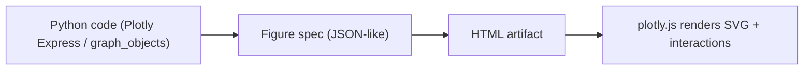
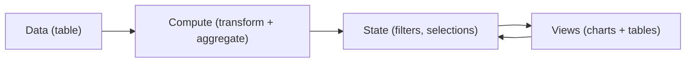

# Interactive Charts and Data Apps

Plotly in Python, interactive chart patterns, and Dash fundamentals (layout + callbacks).

<div class="absolute bottom-10 left-14 leading-tight">
  <div class="text-xl font-700">Marc Reyes</div>
  <div class="op70">Professional Lecturer · marc.reyes@dlsu.edu.ph</div>
  <div class="op70">DATA101 — De La Salle University</div>
</div>

---

## Today’s Plan

<div class="grid grid-cols-2 gap-4 mt-6">
  <div class="card">
    <div class="kicker">01 · Interactivity</div>
    <div class="text-2xl font-700 mt-1"><span class="icon-inline sm i-carbon:cursor-1 mr-2"></span>Show not tell</div>
    <div class="op70 mt-2">Hover, zoom, selections, and linked views.</div>
  </div>
  <div class="card">
    <div class="kicker">02 · Plotly (Python)</div>
    <div class="text-2xl font-700 mt-1"><span class="icon-inline sm i-carbon:chart-line-data mr-2"></span>Interactive charts</div>
    <div class="op70 mt-2">Build a figure, export HTML, ship.</div>
  </div>
  <div class="card">
    <div class="kicker">03 · Other libraries</div>
    <div class="text-2xl font-700 mt-1"><span class="icon-inline sm i-carbon:notebook-reference mr-2"></span>Altair, Bokeh, Panel</div>
    <div class="op70 mt-2">Choose based on the task and constraints.</div>
  </div>
  <div class="card">
    <div class="kicker">04 · Dash</div>
    <div class="text-2xl font-700 mt-1"><span class="icon-inline sm i-carbon:application-web mr-2"></span>Layout + callbacks</div>
    <div class="op70 mt-2">From charts to data apps.</div>
  </div>
</div>

---

## Learning Outcomes

<div class="grid grid-cols-2 gap-4 mt-8">
  <div class="card">
    <div class="kicker">Design</div>
    <div class="text-xl font-700 mt-1">Choose interactions intentionally</div>
    <div class="op70 mt-2">Task first, then hover/zoom/selection.</div>
  </div>
  <div class="card">
    <div class="kicker">Plotly</div>
    <div class="text-xl font-700 mt-1">Ship a single HTML artifact</div>
    <div class="op70 mt-2">Interactive, portable, and reproducible.</div>
  </div>
  <div class="card">
    <div class="kicker">Dash</div>
    <div class="text-xl font-700 mt-1">Explain layout + callbacks</div>
    <div class="op70 mt-2">Inputs → function → outputs.</div>
  </div>
  <div class="card">
    <div class="kicker">Practice</div>
    <div class="text-xl font-700 mt-1">Avoid interactive chart traps</div>
    <div class="op70 mt-2">Fixed scales, clear reset, minimal clutter.</div>
  </div>
</div>

---
layout: section
---

<div class="kicker">Part 1 · Interactive Charts</div>

# <span class="icon-inline i-carbon:cursor-1 mr-3"></span>Interactivity supports a task

Not every chart should be interactive. But when it helps, it can remove work from the viewer.

---

## Use Interactivity When

<div class="grid grid-cols-2 gap-4 mt-6">
  <div class="card">
    <div class="kicker">Inspect</div>
    <div class="text-xl font-800 mt-1">Hover for exact values</div>
    <div class="op70 mt-2">Tooltips replace cluttered labels.</div>
  </div>
  <div class="card">
    <div class="kicker">Focus</div>
    <div class="text-xl font-800 mt-1">Zoom and pan dense series</div>
    <div class="op70 mt-2">Same scale, smaller window.</div>
  </div>
  <div class="card">
    <div class="kicker">Compare</div>
    <div class="text-xl font-800 mt-1">Filter via legend or selection</div>
    <div class="op70 mt-2">Reduce groups without losing context.</div>
  </div>
  <div class="card">
    <div class="kicker">Connect</div>
    <div class="text-xl font-800 mt-1">Linked views (overview → detail)</div>
    <div class="op70 mt-2">One interaction updates another chart.</div>
  </div>
</div>

<div class="callout mt-6">
  <div class="font-800">Rule</div>
  <div class="op80 mt-1">Keep a fixed scale when comparing frames, and always provide a clear reset.</div>
</div>

---
class: viz-slide
---

## Demo: Hover + Zoom + Legend Filter

<div class="op70">Try: hover a point, drag to zoom, scroll to zoom, click legend items to isolate a program.</div>

<div class="viz-grow mt-5">
  <PlotlyMiniTimeSeries class="viz-fill" />
  <div class="mt-2 text-xs op60">Tip: double-click to reset zoom.</div>
</div>

---

## Plotly’s Mental Model

<div class="grid grid-cols-2 gap-4 mt-6 items-start">
  <div class="card">
    <div class="kicker">Key idea</div>
    <div class="text-xl font-800 mt-1">A figure is a spec</div>
    <div class="op70 mt-2">In Python you build a figure object. In the browser, Plotly renders it as HTML + JavaScript.</div>
  </div>
  <div class="mermaid">

  </div>
</div>

<div class="mt-6 card">
  <div class="kicker">Practical consequence</div>
  <div class="op80 mt-2">If you can produce a clean spec, you can export: notebook, report, or a standalone HTML file.</div>
</div>

---
layout: two-cols
---

## Plotly in Python (Minimal Recipe)

<div class="card !p-3">

```python
import plotly.express as px

# df: tidy table (one row = one observation)
fig = px.line(
    df,
    x="week",
    y="pass_rate",
    color="program",
    markers=True,
    title="Pass rate by week",
)

fig.update_layout(
    template="plotly_dark",
    legend_title_text="Program",
    hovermode="x unified",
)

fig.write_html("pass_rate_by_week.html", include_plotlyjs="cdn")
```

</div>

::right::

<div class="card">
  <div class="kicker">What to notice</div>
  <ul class="mt-3">
    <li><span class="font-800">Tidy data</span> makes chart creation predictable.</li>
    <li><span class="font-800">Hovermode</span> controls how tooltips behave.</li>
    <li><span class="font-800">Export</span> produces a shareable artifact.</li>
  </ul>
</div>

<div class="callout mt-4">
  <div class="font-800">Pro habit</div>
  <div class="op80 mt-1">Treat the HTML output like a deliverable: title, units, legend behavior, and default view all matter.</div>
</div>

---

## Exporting Interactive Work

<div class="grid grid-cols-3 gap-4 mt-8">
  <div class="card">
    <div class="kicker">HTML</div>
    <div class="text-xl font-800 mt-1">Interactive</div>
    <div class="op70 mt-2">Hover, zoom, legend filtering.</div>
    <div class="op70 mt-2 text-sm">Best for: web pages, LMS, dashboards.</div>
  </div>
  <div class="card">
    <div class="kicker">PNG / SVG</div>
    <div class="text-xl font-800 mt-1">Static</div>
    <div class="op70 mt-2">Reliable for PDF + slides.</div>
    <div class="op70 mt-2 text-sm">Best for: reports, print, thumbnails.</div>
  </div>
  <div class="card">
    <div class="kicker">JSON spec</div>
    <div class="text-xl font-800 mt-1">Reusable</div>
    <div class="op70 mt-2">Store a figure, regenerate outputs.</div>
    <div class="op70 mt-2 text-sm">Best for: pipelines and QA.</div>
  </div>
</div>

<div class="callout mt-6">
  <div class="font-800">Rule</div>
  <div class="op80 mt-1">If the final medium is static, design the default view so it reads without interaction.</div>
</div>

---

## Interactivity Patterns That Scale

<div class="grid grid-cols-2 gap-4 mt-6">
  <div class="card">
    <div class="kicker">Hover</div>
    <div class="text-xl font-800 mt-1">Inspect without clutter</div>
    <div class="op70 mt-2">Use tooltips, not tiny labels everywhere.</div>
  </div>
  <div class="card">
    <div class="kicker">Legend click</div>
    <div class="text-xl font-800 mt-1">Filter and isolate groups</div>
    <div class="op70 mt-2">Make comparisons easier on demand.</div>
  </div>
  <div class="card">
    <div class="kicker">Brush</div>
    <div class="text-xl font-800 mt-1">Select a range</div>
    <div class="op70 mt-2">Time windows, regions, numeric thresholds.</div>
  </div>
  <div class="card">
    <div class="kicker">Linked views</div>
    <div class="text-xl font-800 mt-1">One input updates another chart</div>
    <div class="op70 mt-2">The core pattern behind dashboards.</div>
  </div>
</div>

---
class: viz-slide
---

## Demo: Overview → Brush → Distribution (Linked Views)

<div class="op70">Drag on the left chart to select a week range. Watch the distribution update.</div>

<div class="viz-grow mt-5">
  <D3CaseStudyOverviewDetail class="viz-fill" />
</div>

---

## Other Python Libraries (Quick Heuristic)

<div class="grid grid-cols-2 gap-4 mt-6 items-start">
  <div class="card">
    <div class="kicker">Declarative</div>
    <div class="text-xl font-800 mt-1">Altair (Vega-Lite)</div>
    <div class="op70 mt-2">Great for rapid, tidy-data exploration and interactive selections with minimal code.</div>
    <div class="mt-3 text-sm">
      <a href="https://altair-viz.github.io/" target="_blank" rel="noopener noreferrer">altair-viz.github.io</a>
    </div>
  </div>
  <div class="card">
    <div class="kicker">Custom tools</div>
    <div class="text-xl font-800 mt-1">Bokeh</div>
    <div class="op70 mt-2">When you need non-standard interactions and fine control over tools.</div>
    <div class="mt-3 text-sm">
      <a href="https://docs.bokeh.org/en/latest/" target="_blank" rel="noopener noreferrer">docs.bokeh.org</a>
    </div>
  </div>
  <div class="card">
    <div class="kicker">Dashboards</div>
    <div class="text-xl font-800 mt-1">Panel / HoloViz</div>
    <div class="op70 mt-2">Compose widgets + plots quickly, especially for exploration.</div>
    <div class="mt-3 text-sm">
      <a href="https://panel.holoviz.org/" target="_blank" rel="noopener noreferrer">panel.holoviz.org</a>
    </div>
  </div>
  <div class="card">
    <div class="kicker">Fast apps</div>
    <div class="text-xl font-800 mt-1">Streamlit</div>
    <div class="op70 mt-2">Simple data apps fast, with tradeoffs in layout and callback control.</div>
    <div class="mt-3 text-sm">
      <a href="https://streamlit.io/" target="_blank" rel="noopener noreferrer">streamlit.io</a>
    </div>
  </div>
</div>

<div class="callout mt-6">
  <div class="font-800">Decision rule</div>
  <div class="op80 mt-1">Pick the tool that matches your delivery: a single HTML file, or a real app with server-side callbacks.</div>
</div>

---
layout: section
---

<div class="kicker">Part 2 · Data Apps</div>

# <span class="icon-inline i-carbon:application-web mr-3"></span>Dash fundamentals

Layout describes structure. Callbacks define behavior.

---

## From Chart to App

<div class="mermaid mt-6">

</div>

<div class="grid grid-cols-2 gap-4 mt-6">
  <div class="card">
    <div class="kicker">Dash framing</div>
    <div class="text-xl font-800 mt-1">Your app is a set of state transitions</div>
    <div class="op70 mt-2">A callback takes inputs and returns updated outputs.</div>
  </div>
  <div class="card">
    <div class="kicker">Pro habit</div>
    <div class="text-xl font-800 mt-1">Separate compute from render</div>
    <div class="op70 mt-2">Cache expensive transforms; keep the UI responsive.</div>
  </div>
</div>

---
layout: two-cols
---

## Dash Layout (Structure)

<div class="card !p-3">

```python
from dash import Dash, html, dcc

app = Dash(__name__)

app.layout = html.Div(
    [
        html.H1("Pass rate dashboard"),
        dcc.Dropdown(["CS", "DS", "IS", "IT"], "CS", id="program"),
        dcc.RangeSlider(1, 20, value=[5, 13], id="week_range"),
        dcc.Graph(id="trend"),
    ],
    className="page",
)
```

</div>

::right::

<div class="card">
  <div class="kicker">Mental model</div>
  <div class="text-xl font-800 mt-1">Layout is a tree</div>
  <div class="op70 mt-2">HTML containers + interactive controls + output components (like `dcc.Graph`).</div>
</div>

<div class="callout mt-4">
  <div class="font-800">Rule</div>
  <div class="op80 mt-1">Start with a minimal layout, then add components one at a time. Debug structure before behavior.</div>
</div>

---
layout: two-cols
---

## Dash Callbacks (Behavior)

<div class="card !p-3">

```python
from dash import Input, Output, callback
import plotly.express as px

@callback(
    Output("trend", "figure"),
    Input("program", "value"),
    Input("week_range", "value"),
)
def update_trend(program, week_range):
    lo, hi = week_range
    view = df.query("program == @program and @lo <= week <= @hi")
    fig = px.line(view, x="week", y="pass_rate", markers=True)
    fig.update_layout(template="plotly_dark", hovermode="x unified")
    return fig
```

</div>

::right::

<div class="card">
  <div class="kicker">What to notice</div>
  <ul class="mt-3">
    <li><span class="font-800">Inputs</span> are the controls.</li>
    <li><span class="font-800">Output</span> is a component property.</li>
    <li>The callback is just a <span class="font-800">pure function</span> of state.</li>
  </ul>
</div>

<div class="callout mt-4">
  <div class="font-800">Debugging trick</div>
  <div class="op80 mt-1">Print the filtered table shape first. If the data is wrong, the figure will be wrong.</div>
</div>

---
class: viz-slide
---

## Live Mini Dashboard (Callback Behavior)

<div class="op70">This slide is a simulated mini app. In Dash, the same state changes happen through callbacks.</div>

<div class="viz-grow mt-5">
  <DashMiniApp />
</div>

---

## Callback Patterns You’ll Use Often

<div class="grid grid-cols-2 gap-4 mt-6">
  <div class="card">
    <div class="kicker">Single output</div>
    <div class="text-xl font-800 mt-1">One input → one figure</div>
    <div class="op70 mt-2">Start here. Keep it debuggable.</div>
  </div>
  <div class="card">
    <div class="kicker">Multi output</div>
    <div class="text-xl font-800 mt-1">One input → chart + table</div>
    <div class="op70 mt-2">Same filtered data drives multiple views.</div>
  </div>
  <div class="card">
    <div class="kicker">Linked views</div>
    <div class="text-xl font-800 mt-1">Brush → update details</div>
    <div class="op70 mt-2">Core dashboard interaction pattern.</div>
  </div>
  <div class="card">
    <div class="kicker">Clientside</div>
    <div class="text-xl font-800 mt-1">Fast UI updates</div>
    <div class="op70 mt-2">When server roundtrips feel slow.</div>
  </div>
</div>

---

## Reliability and Performance

<div class="grid grid-cols-2 gap-4 mt-6">
  <div class="card">
    <div class="kicker">Data</div>
    <ul class="mt-3">
      <li>Validate types and units before plotting.</li>
      <li>Decide your grain (row = what?).</li>
      <li>Make missingness explicit.</li>
    </ul>
  </div>
  <div class="card">
    <div class="kicker">App</div>
    <ul class="mt-3">
      <li>Cache expensive transforms.</li>
      <li>Keep callbacks small and predictable.</li>
      <li>Guard against empty filters.</li>
    </ul>
  </div>
</div>

<div class="callout mt-6">
  <div class="font-800">Rule</div>
  <div class="op80 mt-1">Separate: compute once, render many. A dashboard is mostly data plumbing.</div>
</div>

---

## What I’d Ship (Professional Checklist)

<div class="grid grid-cols-2 gap-4 mt-6">
  <div class="card">
    <div class="kicker">Task</div>
    <div class="text-xl font-800 mt-1">What question is this answering?</div>
    <div class="op70 mt-2">Interactivity must reduce viewer work.</div>
  </div>
  <div class="card">
    <div class="kicker">Interaction</div>
    <div class="text-xl font-800 mt-1">Reset, defaults, fixed scales</div>
    <div class="op70 mt-2">No “mystery states”.</div>
  </div>
  <div class="card">
    <div class="kicker">Data</div>
    <div class="text-xl font-800 mt-1">Units, grain, validation</div>
    <div class="op70 mt-2">Most bugs are data bugs.</div>
  </div>
  <div class="card">
    <div class="kicker">Ship</div>
    <div class="text-xl font-800 mt-1">HTML artifact or deployed app</div>
    <div class="op70 mt-2">Pick the delivery format early.</div>
  </div>
</div>

---

## References (Recommended)

<div class="grid grid-cols-2 gap-4 mt-6">
  <div class="card">
    <div class="text-lg font-700">Plotly Python docs</div>
    <div class="op70 mt-1">Interactive charts + HTML export + animations</div>
    <div class="mt-2 text-sm">
      <a href="https://plotly.com/python/" target="_blank" rel="noopener noreferrer">plotly.com/python</a>
    </div>
  </div>
  <div class="card">
    <div class="text-lg font-700">Dash docs</div>
    <div class="op70 mt-1">Layout, callbacks, deployment patterns</div>
    <div class="mt-2 text-sm">
      <a href="https://dash.plotly.com/" target="_blank" rel="noopener noreferrer">dash.plotly.com</a>
    </div>
  </div>
  <div class="card">
    <div class="text-lg font-700">Altair docs</div>
    <div class="op70 mt-1">Declarative grammar + interactive selections</div>
    <div class="mt-2 text-sm">
      <a href="https://altair-viz.github.io/" target="_blank" rel="noopener noreferrer">altair-viz.github.io</a>
    </div>
  </div>
  <div class="card">
    <div class="text-lg font-700">Bokeh docs</div>
    <div class="op70 mt-1">Custom tools + interactive plotting</div>
    <div class="mt-2 text-sm">
      <a href="https://docs.bokeh.org/en/latest/" target="_blank" rel="noopener noreferrer">docs.bokeh.org</a>
    </div>
  </div>
</div>
