# Data & Task Abstraction

A practical framework for translating domain questions into defensible visual designs.

<div class="absolute bottom-10 left-14 leading-tight">
  <div class="text-xl font-700">Marc Reyes</div>
  <div class="op70">Professional Lecturer · marc.reyes@dlsu.edu.ph</div>
  <div class="op70">DATA101 — De La Salle University</div>
</div>

<!--
TALK TRACK (≈3–4 min)

Good day everyone—I'm Marc Reyes. Today we’re focusing on Data and Task Abstraction. I want you to treat this as a professional skill, not a “theory topic.”

In real data visualization work, drawing the chart is rarely the hardest part. The hard part is translating a human question into something a visualization can answer reliably. That translation step is abstraction.

Over the next set of slides, you’ll learn a simple workflow that lets you justify your visualization choices: first clarify the tasks, then describe the data structure, then decide what transformations are required, and only then choose encodings and interactions.

If you’ve ever felt stuck thinking “What chart should I use?”, that’s usually not a chart problem—it’s an abstraction problem. You’re missing a clear task specification or data specification.

We’ll use a running example about student performance so the ideas stay grounded, and we’ll do short exercises so you practice writing abstractions the way professionals do in projects.

As we go, I’ll ask quick questions—please answer even if you’re not fully sure. Abstraction improves by surfacing assumptions early.
-->

---

## Today’s Plan

<div class="grid grid-cols-2 gap-4 mt-5">
  <div class="card">
    <div class="kicker">01 · Setup</div>
    <div class="text-2xl font-700 mt-1">Why abstraction matters</div>
    <div class="op70 mt-2">Avoid the chart‑first trap.</div>
  </div>
  <div class="card">
    <div class="kicker">02 · Data</div>
    <div class="text-2xl font-700 mt-1">Dataset + attribute types</div>
    <div class="op70 mt-2">What you have, what it means.</div>
  </div>
  <div class="card">
    <div class="kicker">03 · Tasks</div>
    <div class="text-2xl font-700 mt-1">Goals + actions + targets</div>
    <div class="op70 mt-2">What your user needs to do.</div>
  </div>
  <div class="card">
    <div class="kicker">04 · Design</div>
    <div class="text-2xl font-700 mt-1">From abstraction → charts</div>
    <div class="op70 mt-2">Views + interactions you can defend.</div>
  </div>
  <div class="card col-span-2">
    <div class="kicker">05 · Practice</div>
    <div class="text-2xl font-700 mt-1">Exercises + exit ticket + Python assignment</div>
    <div class="op70 mt-2">Write abstractions like a practitioner (then implement in pandas).</div>
  </div>
</div>

<!--
TALK TRACK (≈3 min)

Here’s the flow for today.

First, we establish why abstraction matters—because it prevents the most common failure mode in student and professional work: picking a chart first and only later realizing it doesn’t answer the real question.

Second, we do data abstraction. We’ll classify dataset types—table, temporal, spatial, network, hierarchy, and hybrids—and we’ll label variables by attribute type—categorical, ordinal, quantitative, temporal. We’ll also talk about transformations, because visualization quality depends heavily on how the data is prepared.

Third, we do task abstraction. This is where we rewrite vague domain questions into explicit tasks: action + target + constraints + output. This step is what makes your design choices defendable.

Then we connect abstractions to design: which views and interactions best support the tasks, given the data structure.

Finally, we’ll practice twice in class and end with an exit ticket plus a Python assignment where you implement the same workflow in pandas.
-->

---

## Learning Outcomes

<div class="grid grid-cols-2 gap-4 mt-8">
  <div class="card">
    <div class="kicker">Data</div>
    <div class="text-xl font-700 mt-1">Identify dataset structure</div>
    <div class="op70 mt-2">Table, time series, spatial, network, hybrid…</div>
  </div>
  <div class="card">
    <div class="kicker">Data</div>
    <div class="text-xl font-700 mt-1">Label attribute types</div>
    <div class="op70 mt-2">Categorical, ordinal, quantitative, temporal.</div>
  </div>
  <div class="card">
    <div class="kicker">Tasks</div>
    <div class="text-xl font-700 mt-1">Write task statements</div>
    <div class="op70 mt-2">Action + Target + Constraints + Output.</div>
  </div>
  <div class="card">
    <div class="kicker">Design</div>
    <div class="text-xl font-700 mt-1">Justify chart + interaction</div>
    <div class="op70 mt-2">Design decisions that map to data + tasks.</div>
  </div>
</div>

<!--
TALK TRACK (≈3–4 min)

These are the outcomes I’m looking for in your projects and exams.

First: you can identify dataset structure. That means you can look at a dataset and say “this is primarily a table,” or “this is a time series,” or “this is spatial regions,” or “this is a network,” and you can recognize when it’s hybrid.

Second: you can correctly label variable types. This is non‑negotiable—if you treat a category code as a number, your chart will imply false meaning. If you treat time as categories, you lose ordering. Correct types protect you from accidental misinformation.

Third: you can write task statements. I don’t want “make a line chart.” I want tasks like “detect when performance drops,” “compare sections against a baseline,” or “rank programs by pass rate.” Tasks are the contract your visualization must satisfy.

Fourth: you can justify your design. A professional can explain why a chart and interaction choices match the tasks and the data. That’s what builds credibility: it’s not only that your slide looks good, but that it’s correct, useful, and defensible.

Keep these in mind—the rest of the lecture is basically tools to achieve these outcomes.
-->

---

## Warm-Up (3 minutes)

<div class="callout mt-6">
  <div class="kicker">Prompt</div>
  <div class="text-2xl font-700 mt-2">“The Dean wants to know if students are struggling more this term.”</div>
</div>

<div class="grid grid-cols-3 gap-4 mt-8">
  <div class="card">
    <div class="kicker">Metric</div>
    <div class="mt-2">Scores? pass rate? attendance? drop rate?</div>
  </div>
  <div class="card">
    <div class="kicker">Baseline</div>
    <div class="mt-2">Last term? last year? another section?</div>
  </div>
  <div class="card">
    <div class="kicker">Output</div>
    <div class="mt-2">Which groups? when? how big? how confident?</div>
  </div>
</div>

<!--
TALK TRACK (≈3–5 min)

Let’s treat this like a real client request. “Students are struggling more this term” is not yet a visualization question—it’s a domain statement.

First decision: what does “struggling” mean in data terms? Is it lower quiz scores, higher failure rates, lower attendance, fewer LMS logins, or more late submissions? Each choice implies different variables and sometimes different data sources.

Second decision: what’s the comparison baseline? “More” must be relative to something: last term, last year, a target threshold, or another cohort. If you can’t name the baseline, the task isn’t a comparison yet.

Third decision: what output will the Dean act on? Do they want a ranked list of at‑risk sections, a time window where things changed, or flagged groups that require intervention? That output determines what the visualization must enable.

I’ll give you 30 seconds: pick one metric and one baseline. Then I’ll ask two people to share. While you listen, notice the assumptions: you’re deciding what “struggling” means and what “more” means. That’s exactly the abstraction step we’re learning today.
-->

---
layout: statement
---

# Abstraction = <span class="gradient-text">translation</span>

From **domain language** → to **general structures** that visualization methods can support.

<!--
TALK TRACK (≈3–4 min)

This one sentence is the foundation: abstraction is translation.

In the domain, people speak in human terms: “struggling,” “improving,” “traffic is worse,” “sales dropped.” Those phrases don’t map directly to charts.

Abstraction translates domain language into two things we can design for: tasks and data structures. Tasks are actions like compare, rank, detect, locate. Data structures are things like tables, time series, spatial regions, networks.

Once you translate correctly, design stops being guesswork. You can say: “The task is comparison over time, so I need temporal structure and aligned scales.” Or: “The task is to find communities, so I’m dealing with network structure.”

Translation also exposes missing requirements. If the task is “compare this term vs last term,” you immediately know you need last term data. If the task is “locate when it started,” you need time-stamped data at the right granularity.

So whenever you feel tempted to start with “which chart,” pause and translate: What is the task? What is the data? That is how professionals avoid bad charts.
-->

---

## The Chart-First Trap (and How to Avoid It)

<div class="grid grid-cols-2 gap-4 mt-4">
  <div class="card">
    <div class="kicker">Common failure mode</div>
    <div class="text-xl font-700 mt-2">Chart‑first thinking</div>
    <div class="op70 mt-2">“Make a bar chart” is a solution, not a problem statement.</div>
  </div>
  <div class="card">
    <div class="kicker">Professional workflow</div>
    <div class="text-xl font-700 mt-2">Abstraction‑first thinking</div>
    <div class="op70 mt-2">Question → tasks → data needs → transforms → design.</div>
  </div>
</div>

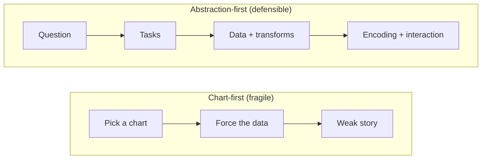

<!--
TALK TRACK (≈4–5 min)

This diagram is the reality of many student submissions and many real dashboards.

The bottom path—chart-first—starts with “Pick a chart.” That feels productive because you immediately get something that looks like output. But then you start forcing the data to fit the chart: you aggregate too early, you drop important variables, or you pick the wrong baseline. The result is usually a weak story, because the chart wasn’t chosen to support a real task.

The top path—abstraction-first—is what we want. Start with the question. Then define the tasks: what does someone need to do with the visualization—compare across groups, detect change over time, locate where a drop begins, rank programs. Then you specify the data needs and transformations. Only after that do you choose encodings and interactions.

Here’s a concrete example. Someone says “make a bar chart of programs.” If we translate it, the real task might be “compare programs by pass rate this term vs last term.” Now we know we need a pass rate measure, denominators, and last term data. A bar chart might still be fine, but it’s now justified and correctly constructed.

The takeaway is not “never pick charts.” The takeaway is: charts are the consequence of a clear task and data spec. That’s how you avoid being fooled by pretty but useless visuals.
-->

---

## Munzner’s Nested Model (Where Abstraction Lives)

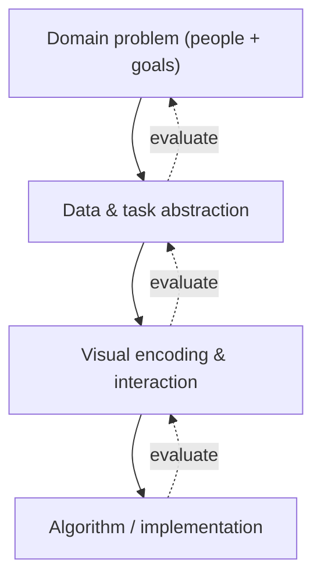

<!--
TALK TRACK (≈5 min)

This is Munzner’s nested model, and it’s a professional way to think about visualization work.

At the top is the domain problem: the people involved, the real goals, and the decisions that will be made. This is where “struggling students” lives.

Next is data and task abstraction. This is the translation layer. Here we define: what are the tasks—compare, rank, detect, locate—and what is the data structure—table, time series, network, and so on. We also decide what transformations are required to make the data support the tasks.

Then we choose visual encoding and interaction: marks and channels, and the interaction techniques that let users complete tasks.

Finally, we implement: algorithms, performance, and code.

The dotted arrows labeled “evaluate” are the most important part. You don’t only evaluate at the end. You evaluate at each level. If your visualization feels impossible to design, it’s often because you chose the wrong abstraction: you’re missing a baseline, you used the wrong unit of analysis, or you treated a categorical variable as quantitative.

So when you’re stuck, don’t just tweak colors or switch chart types. Move up the model and ask: are the tasks clear? is the data structure correct? do we need different transforms? That’s how professionals debug visualization problems.
-->

---
layout: two-cols
---

# Two Outputs You Should Be Able to Write

<div class="op80 mt-2">
  Before picking charts: write the <strong>task spec</strong> and <strong>data spec</strong>.
</div>

::left::
<div class="card mt-4">
  <div class="kicker">Task abstraction</div>
  <div class="text-xl font-700 mt-1">Why → How → What</div>
</div>

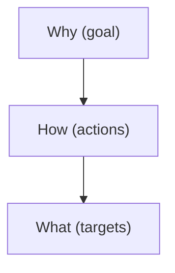

::right::
<div class="card mt-4">
  <div class="kicker">Data abstraction</div>
  <div class="text-xl font-700 mt-1">Types → Variables → Transforms</div>
</div>

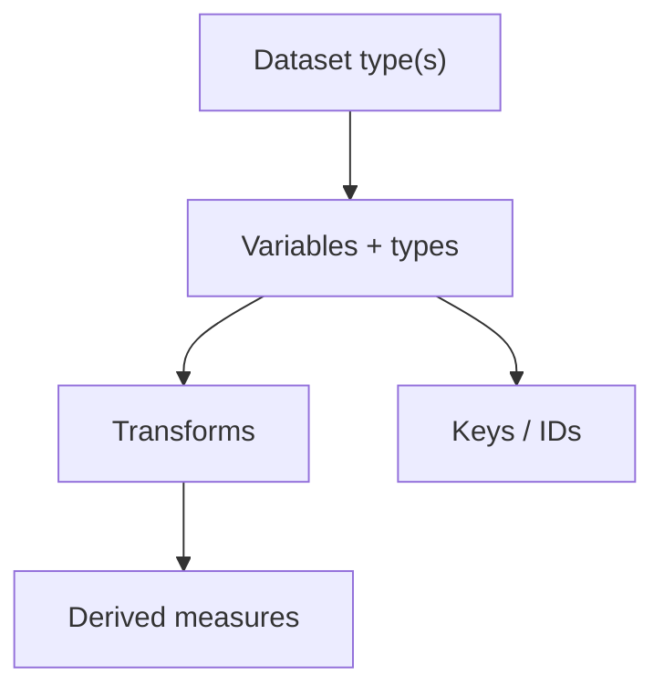

<!--
TALK TRACK (≈4–5 min)

This slide is a practical checklist. Before you pick charts, you should be able to write two outputs.

On the left is the task spec. Start with WHY: what’s the goal—discover patterns, present findings, monitor metrics, or do quick lookup? Then HOW: what actions must the visualization support—compare, rank, detect, locate, filter. Then WHAT: what objects are you acting on—items, groups, attributes, time ranges, links. A good task spec reads like a contract: “The user must be able to compare sections by pass rate this term versus last term and identify the top three declines.”

On the right is the data spec. First, declare the dataset type. Is it a table? a time series? spatial regions? a network? Then list variables and their types, including units. Then list transformations you must do: cleaning missing values, aggregating to the right granularity, reshaping from wide to long, and deriving measures like rates.

If you do these two steps, your design becomes defendable. You can explain why a particular encoding or interaction exists: because it supports a named task on a known data structure.

In your assignment and projects, I want to see these written down—because “pretty slides” without a spec are how you end up with charts that can’t answer the real question.
-->

---

## Running Example (We’ll Use This All Lecture)

**Question:** “Are students struggling more this term?”

<v-clicks>

- Possible data sources: weekly quizzes, attendance logs, LMS activity, advising records
- Possible unit of analysis: student, section, program, college
- Possible time scale: week, month, midterms/finals phases

</v-clicks>

<!--
TALK TRACK (≈3–4 min)

We’ll keep returning to this question so you can see abstraction in action.

The question is simple on the surface, but notice how many decisions are hidden inside it. “Struggling” must be defined as a measurable outcome. Even if we choose grades, we still need to decide which assessment—quizzes, midterms, finals, or an overall weighted score.

Then we choose data sources. Grades might tell you the result, but attendance and LMS activity can tell you early signals. Advising records might reveal patterns by program or workload.

Next, the unit of analysis. If we want to intervene, do we need to identify at-risk students, or is the decision at the section or program level? The unit of analysis affects what we aggregate and how we visualize.

Finally, time scale. If the task is to locate when problems started, we need time in the data at a meaningful resolution—weekly is common. If we only have two points, like midterm and final, we can’t really locate a start.

So this slide sets up the idea that abstraction is about making these choices explicit before design. Next, we’ll define what a “good answer” must let someone do.
-->

---

## What a “Good Answer” Looks Like

<div class="kicker mt-2">Success criteria</div>

<div class="grid grid-cols-2 gap-4 mt-6">
  <div class="card">
    <div class="kicker">Target</div>
    <div class="text-2xl font-700 mt-1">Who?</div>
    <div class="op70 mt-2">Which sections/programs are struggling?</div>
  </div>
  <div class="card">
    <div class="kicker">Time</div>
    <div class="text-2xl font-700 mt-1">When?</div>
    <div class="op70 mt-2">Which weeks; before/after which event?</div>
  </div>
  <div class="card">
    <div class="kicker">Magnitude</div>
    <div class="text-2xl font-700 mt-1">How much?</div>
    <div class="op70 mt-2">Show distributions, not just averages.</div>
  </div>
  <div class="card">
    <div class="kicker">Baseline</div>
    <div class="text-2xl font-700 mt-1">Compared to what?</div>
    <div class="op70 mt-2">Last term, target, or benchmark.</div>
  </div>
</div>

<!--
TALK TRACK (≈3–4 min)

This is what I mean by “task-driven” thinking. A good visualization is not judged by its aesthetics alone—it’s judged by whether it enables the right answers.

First: Who is struggling? That implies grouping and comparison across groups. Your design must make group differences legible—often through aligned position and ordering.

Second: When did it start? That implies a temporal structure and an ability to locate a time window or change point. Line charts can help, but only if the time resolution supports the task.

Third: How much worse is it? That implies magnitude and distribution. If you only show averages, you can hide important variance. A professional answer often includes distributions, uncertainty, or at least sample sizes.

Fourth: Compared to what? This is the baseline problem. “More” is meaningless without a baseline. So in your tasks, always name the baseline, and in your charts, make the baseline visible through reference lines, paired views, or annotations.

If you keep these four “outputs” in mind, you won’t accidentally build a visualization that looks clean but can’t support decision making. Now we’ll move into data abstraction: understanding what data structure we have and what we need.
-->

---
layout: section
---

<div class="kicker">Part 1 · Data</div>

# <span class="gradient-text">Data Abstraction</span>

From domain data → **dataset types + attribute types + transformations**

<!--
TALK TRACK (≈3–4 min)

We’re now entering the data abstraction part of the workflow. The goal here is to describe your data in a way that visualization methods understand.

In the domain, we talked about “students struggling.” In data abstraction, we ask: what are the items we observe? what variables describe those items? do we have relationships between items? and do we have positions like time order or spatial coordinates?

This is important because different dataset types support different operations. A table supports filtering, grouping, and ranking. A time series supports detecting trends and change points. A spatial dataset supports proximity and regional comparison. A network supports connectivity, paths, and community structure.

So instead of saying “we have a CSV,” we’ll learn to say “we have a table of section‑week records with categorical section, temporal week, and quantitative measures.” That level of description is what lets you confidently choose designs later.

As we go through dataset types and attribute types, keep the running example in your head. Ask yourself: what is the primary organizing key for the student question, and what transformations would we need before visualizing?
-->

---

## Data Abstraction: What You Produce

<div class="callout mt-6 text-2xl font-700">
  Dataset type(s) + attribute types + required transforms
</div>

<v-clicks>

- Dataset type(s): table, time series, spatial, hierarchy, network, field, sets
- “Items” vs “relationships” vs “positions”
- Variable list with attribute types + units
- Required transformations: cleaning, aggregation, binning, derived measures

</v-clicks>

<!--
TALK TRACK (≈3–4 min)

Here’s what a “data abstraction” deliverable looks like in practice.

First, you declare the dataset type or types. Most real problems are hybrid, but there is usually a primary structure: a table, a time series, a spatial dataset, a network, and so on.

Second, you distinguish between items, relationships, and positions. Items are the things you measure—students, sections, sessions. Relationships are links—prerequisites, collaborations, referrals. Positions are things like time order or geographic coordinates.

Third, you list variables and their attribute types and units. This is where you prevent errors like treating a category code as quantitative or treating time as unordered.

Finally, you list transformations. This is not just “clean missing values.” It includes aggregation choices, binning choices, and derived measures like rates. In visualization, transforms are design decisions because they change the story the data can tell.

If you can write these four parts clearly, the later design phase becomes much easier—and your work becomes defendable.
-->

---

## Start With an Inventory (Before Any Charts)

| Question | What you write down |
|---|---|
| What are the **items**? | rows / records (students, sessions, transactions) |
| What are the **variables**? | columns (program, score, week, minutes) |
| Are there **relationships**? | links (prerequisite, collaboration, referral) |
| Are there **positions**? | time order, coordinates, grid cells |

<!--
TALK TRACK (≈3–4 min)

This inventory table is a simple habit that prevents messy projects.

Start by naming the items. What is one row, conceptually? Is it a student? a quiz attempt? a section‑week summary? This determines what comparisons are meaningful.

Then list the variables. Think of them as the attributes you can encode visually: program, week, score, minutes, attendance rate. Make sure you’re not mixing incompatible units or scales.

Then ask if you have relationships. Many problems don’t, but when you do—like prerequisites or collaboration—your dataset is not “just a table.” It’s a network, and tasks like “find hubs” or “find paths” become relevant.

Finally, ask if you have positions: time order, geographic coordinates, grid cells. Positions often define your axes in a visualization. If you have time, you can support “when did it start?” If you have space, you can support “where is it concentrated?”

For our running example, you can already imagine multiple valid item definitions. That choice is the beginning of design.
-->

---

## Dataset Types (Visualization Lens)

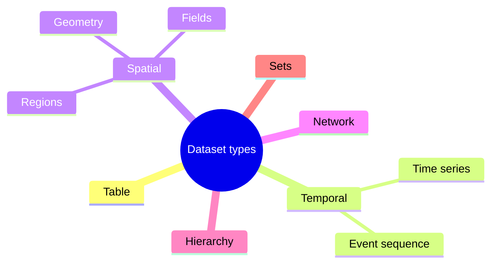

<!--
TALK TRACK (≈4–5 min)

This mindmap is your mental “menu” of dataset types. Most of the time, students think everything is a table, because it’s stored in rows and columns. But the structure is deeper than the file format.

Tables are items with attributes. Temporal datasets add ordering and continuity—time series and event sequences. Spatial datasets come in three forms: geometry (points/lines), regions (polygons), and fields (values everywhere). Networks are nodes and links. Hierarchies are trees—parent/child. Sets represent membership and overlaps.

The reason this matters is that each dataset type comes with typical tasks. Time series often support trend and change detection. Spatial regions support comparison across areas, but require careful normalization. Networks support connectivity and community analysis.

In real work, datasets are hybrid. For example, a “table” of student records might include time, making it table + temporal. Your job is to choose the primary structure based on the tasks and then treat the rest as attributes or facets.

As we go through each type, I’ll keep connecting it back to the running example so you see how these abstractions guide design.
-->

---

## Dataset Type: Table (Items × Attributes)

**Example:** student records

<v-clicks>

- Items: students or section-week records
- Typical transforms: group-by, summarize, sort, filter
- Typical views: bar chart (compare), dot plot (rank), histogram/box plot (distribution)

</v-clicks>

<!--
TALK TRACK (≈3–4 min)

The table is the default dataset type: items by attributes.

In our course context, a common table could be one row per student, with attributes like program, GPA, attendance rate. Another valid table is one row per section‑week record, where the attributes are week, average score, pass rate, and number of students.

Once you decide the item, you can choose transformations. Group-by and summarize are the big ones: you might summarize by section or by program. Sorting and filtering are also fundamental.

Then you choose views based on tasks. For comparing groups, bar charts or dot plots can work—dot plots often scale better when there are many categories. For ranking, sorting is key. For understanding typical performance and outliers, distributions like histograms or box plots are more honest than a single average.

The main lesson: table data doesn’t automatically mean “bar chart.” It means you have items with attributes—and you must choose an encoding that supports the task.
-->

---

## Dataset Type: Time Series (Ordered by Time)

**Common mistakes:** missing weeks, irregular sampling, mixing time zones.

<v-clicks>

- Decide the time unit (day/week/month) and make it explicit
- Consider smoothing carefully (rolling mean can hide spikes)
- Baselines matter: compare to last term or target performance

</v-clicks>

<!--
TALK TRACK (≈4–5 min)

Time series data is table data plus ordering—and that ordering changes what tasks are possible.

The most common mistakes happen before you draw anything. Missing weeks or irregular sampling can create fake trends. Mixing time zones can shift events. And if you don’t declare your time unit explicitly, two people can interpret “week” differently.

For our running example, “when did it start?” is a time series task. To answer it, you need a consistent time axis—maybe weekly—and you need to decide how to handle missing data. Do you fill missing weeks with zeros? leave gaps? The choice changes interpretation.

Smoothing is another design decision. A rolling mean might make a chart look nicer, but it can hide spikes that matter. If the task is detection—like identifying drop points—you need to be careful not to smooth away the signal.

Finally, baselines are critical over time. A line chart without a baseline still doesn’t answer “more.” You need last term, a target band, or a benchmark line. Time series is powerful, but only when the abstraction is correct.
-->

---

## Spatial Data: Geometry vs Regions vs Fields

<v-clicks>

- **Geometry:** points/lines (GPS pings, routes) → proximity, clusters
- **Regions:** polygons (cities/barangays) → compare areas, choropleths (careful with population)
- **Fields:** values everywhere (density/temperature) → heatmaps, contours, binning choices

</v-clicks>

<!--
TALK TRACK (≈4–5 min)

Spatial data is not one thing. It comes in three common forms, and each form supports different tasks and different visual forms.

Geometry is points and lines—like GPS pings or routes. Typical tasks are proximity, clustering, and paths.

Regions are polygons—like barangays or districts. Here the classic visualization is a choropleth map, but the biggest professional warning is: do not map raw counts. You almost always need normalization, like “per 1,000 people,” because bigger regions often have bigger counts.

Fields are values everywhere—like temperature, density, or signal strength. You often create fields from events by binning into grid cells. That means your map depends on bin size, interpolation, and smoothing—again, transformations are design decisions.

Even if we’re not doing spatial maps in the running example, the lesson transfers: always ask what kind of “space” you have, what tasks you need, and what transformations create the structure you’ll visualize.
-->

---
layout: two-cols
---

# Hierarchy vs Network (Know the Difference)

::left::
**Hierarchy** (parent → child)

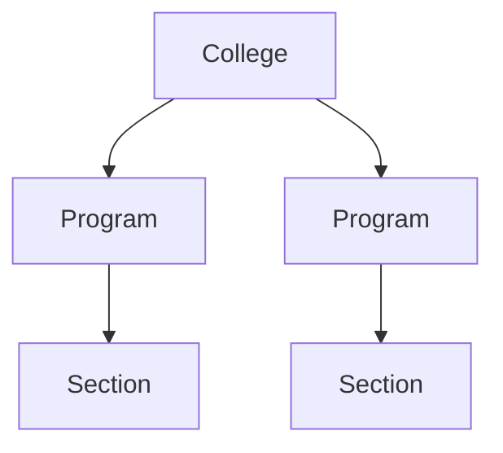

::right::
**Network** (links between peers)


<!--
TALK TRACK (≈4–5 min)

This distinction is a classic source of confusion, so I want you to be very clear about it.

A hierarchy is a tree: each child has one parent, and there’s a single path from the root. Examples are organizational structures—college → program → section. Typical tasks include “drill down,” “roll up,” and “compare siblings.”

A network is not a tree. Nodes can have multiple connections, cycles, and no single root. Examples include social connections, collaboration graphs, or prerequisite graphs when courses have multiple prerequisites. Typical tasks include “find hubs,” “find bridges,” “find communities,” and “trace paths.”

Why does this matter for visualization? Because the encodings differ. A tree layout or indented list works for hierarchies. For networks, tree layouts can lie by implying parent/child relationships that don’t exist. Conversely, using a force-directed network for a true hierarchy can obscure the simple structure.

When you do data abstraction, you’re deciding which structure you actually have. That decision tells you what tasks are valid and what visual forms are appropriate.

Quick check: if removing one edge can change the “parent” of a node, it’s probably not a hierarchy—it’s a network.
-->

---

## Fields & Density: Why Binning Is a Design Decision

<v-clicks>

- Raw events → bins (grid cells, time windows) → aggregated values
- Bigger bins: smoother but can hide local patterns
- Smaller bins: detailed but noisier; may exaggerate randomness

</v-clicks>

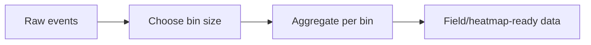

<!--
TALK TRACK (≈4–5 min)

Binning is one of the most underappreciated design decisions in visualization.

When you start with raw events—quiz attempts, logins, Wi‑Fi sessions—you often can’t visualize them directly because there are too many points. So you aggregate into bins: time windows, grid cells, or grouped categories.

But the bin size changes what patterns appear. Large bins create smoother trends and can hide important local spikes. Small bins reveal detail but can exaggerate noise and make random variation look meaningful.

So in a professional workflow, you don’t treat binning as a purely technical step. You treat it as part of your data abstraction and transformation spec. You choose bin size based on the task. If the task is monitoring weekly patterns, weekly bins are sensible. If the task is detecting sudden changes, you might need daily bins.

This is also where you should think about uncertainty and sample size. A bin with only a few events is noisy. Good visualizations communicate that, either through annotations, confidence bands, or at least showing counts.
-->

---

## Sets & Membership Data

**When items belong to multiple groups** (e.g., students in orgs + electives).

<v-clicks>

- Dataset structure: items + membership lists
- Typical tasks: overlap, exclusive groups, coverage
- Warning: Venn diagrams don’t scale; consider tables or UpSet-style views

</v-clicks>

<!--
TALK TRACK (≈3–4 min)

Sets show up when items can belong to multiple groups. Students can be in multiple orgs, enroll in multiple electives, or belong to multiple programs over time.

The key abstraction here is membership. Your data might be a list of (student, group) pairs. The typical tasks are overlap—who is in both A and B—coverage—how many students are in at least one support program—and exclusivity—who is only in one group.

The warning about Venn diagrams is practical: they work for two or three sets, but they don’t scale. Once you have more sets, the diagram becomes unreadable and misleading.

Professional alternatives include tables, bar charts of membership counts, or UpSet-style visualizations that scale to many sets. Even if you don’t build an UpSet plot in this course, the key is: recognize membership structure early, because it changes what tasks and encodings make sense.
-->

---

## Hybrid Datasets (Most Real Problems)

Many datasets are **table + time + category** (and sometimes spatial).

<v-clicks>

- Choose a primary structure (often a table of records)
- Decide whether time/space are axes or attributes; keep stable IDs (student_id, section_id)

</v-clicks>

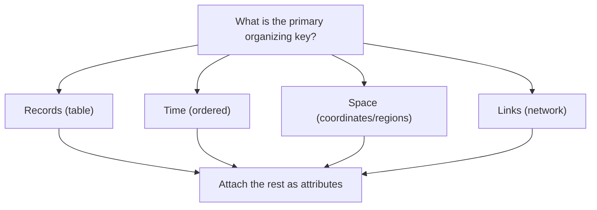

<!--
TALK TRACK (≈4–5 min)

This slide describes how to think when your dataset has multiple structures—which is most real problems.

Many datasets are table + time + category. The trick is to choose a primary organizing key. Ask: what is the core record? Often it’s a table of events or a table of aggregated records.

Then you attach time, space, or links as attributes depending on your tasks. If your main task is “when did it start,” time becomes an axis and you design around it. If time is not central, it can remain an attribute.

In our running example, one good abstraction is: a table of section‑week records. Time is ordered and becomes a natural x‑axis. Section is categorical and supports grouping and comparison. Measures like pass rate are quantitative.

Also note the stable ID point. If you can’t reliably join student_id or section_id across sources, your visual analysis becomes fragile. Data abstraction includes making sure identifiers exist and are stable.
-->

---

## Attribute Types (Semantics of Variables)

<div class="grid grid-cols-2 gap-4 mt-6">
  <div class="card">
    <div class="flex items-baseline justify-between">
      <div class="text-xl font-700">Categorical</div>
      <div class="op70 text-sm">different kinds</div>
    </div>
    <div class="mt-3 op85">Examples: program, device_type</div>
    <div class="mt-2 op70 text-sm">Channels: color hue, shape, grouping</div>
    <div class="mt-4 h-2 rounded-full bg-gradient-to-r from-sky-400 to-violet-400 op80"></div>
  </div>

  <div class="card">
    <div class="flex items-baseline justify-between">
      <div class="text-xl font-700">Ordinal</div>
      <div class="op70 text-sm">ranked kinds</div>
    </div>
    <div class="mt-3 op85">Examples: Likert 1–5, grade bands</div>
    <div class="mt-2 op70 text-sm">Channels: position, ordered color</div>
    <div class="mt-4 h-2 rounded-full bg-gradient-to-r from-gray-500 to-gray-200 op80"></div>
  </div>

  <div class="card">
    <div class="flex items-baseline justify-between">
      <div class="text-xl font-700">Quantitative</div>
      <div class="op70 text-sm">magnitude</div>
    </div>
    <div class="mt-3 op85">Examples: score, minutes, count</div>
    <div class="mt-2 op70 text-sm">Channels: position, length, size</div>
    <div class="mt-4 grid grid-cols-6 gap-1 items-end">
      <div class="h-2 bg-sky-500/70 rounded"></div>
      <div class="h-4 bg-sky-500/70 rounded"></div>
      <div class="h-6 bg-sky-500/70 rounded"></div>
      <div class="h-3 bg-sky-500/70 rounded"></div>
      <div class="h-7 bg-sky-500/70 rounded"></div>
      <div class="h-5 bg-sky-500/70 rounded"></div>
    </div>
  </div>

  <div class="card">
    <div class="flex items-baseline justify-between">
      <div class="text-xl font-700">Temporal</div>
      <div class="op70 text-sm">time</div>
    </div>
    <div class="mt-3 op85">Examples: week, timestamp</div>
    <div class="mt-2 op70 text-sm">Channels: position (x), ordering</div>
    <div class="mt-4 flex items-center gap-2 op80">
      <div class="h-2 w-2 rounded-full bg-sky-400"></div>
      <div class="h-0.5 flex-1 bg-white/20 rounded-full"></div>
      <div class="h-2 w-2 rounded-full bg-sky-400"></div>
      <div class="h-0.5 flex-1 bg-white/20 rounded-full"></div>
      <div class="h-2 w-2 rounded-full bg-sky-400"></div>
    </div>
  </div>
</div>

<!--
TALK TRACK (≈4–5 min)

Attribute types describe meaning, not just storage. “42” in a CSV could be a count, a category code, or an identifier—and each implies different valid operations.

Categorical means different kinds. You can count categories and compare frequencies, but you can’t average them. Ordinal means ranked categories, like Likert scales. You can order them and compute medians, but you shouldn’t assume equal gaps unless justified.

Quantitative means magnitude. This is where differences, ratios, and meaningful averages live. Temporal means time—ordering and intervals.

Why does this matter for visualization? Because attribute types strongly suggest which channels are safe. Quantitative data is best encoded with position or length. Categories are best encoded with hue and grouping. Ordinal data needs ordered encodings like position or lightness. Time naturally maps to a position axis with ordering.

If you correct types early, you prevent a lot of misleading design decisions. Quick class check: is student_id quantitative? No—it’s an identifier. If you average it, the result is nonsense.
-->

---

## Measurement Scales (What Math Is Valid?)

| Scale | Example | You can do… | Don’t… |
|---|---|---|---|
| Nominal | program | count, mode | average it |
| Ordinal | rank, Likert | median, order | assume equal gaps |
| Interval | °C | differences | claim “twice as hot” |
| Ratio | counts, ₱ | ratios, % change | ignore units |

<!--
TALK TRACK (≈4–5 min)

Measurement scales are about what math is valid, which directly affects both analysis and visualization.

Nominal data is just labels. You can count and compare frequencies, but you can’t compute meaningful averages. Ordinal data is ranked, so medians and ordered comparisons make sense, but equal spacing is not guaranteed.

Interval data has meaningful differences but no true zero. Temperature in Celsius is the classic example: 20°C minus 10°C is meaningful, but 20°C is not “twice” 10°C.

Ratio data has a true zero, so ratios and percent change are meaningful—counts, money, time duration.

This matters because visualizations often imply mathematical operations. A line chart of an ordinal scale might imply consistent intervals when they don’t exist. A bar chart of category codes might imply magnitude differences that are not real.

So when you label variable types, also think about scale. It’s how you avoid accidental misuse of statistics and accidental misleading graphics.
-->

---

## Identifiers vs Measures vs Categories

<v-clicks>

- **Identifier:** labels one item (StudentID, SectionCode) → use for joins, not charts
- **Measure:** numeric value with meaning (score, minutes, count) → plot/analyze
- **Category code:** looks numeric but is categorical (1=CS, 2=IT) → treat as categorical

</v-clicks>

<div class="muted mt-4">
Quick test: “If I average this, does the result mean anything?”
</div>

<!--
TALK TRACK (≈4–5 min)

This slide is a practical guardrail, because many misleading charts come from confusing these three categories.

Identifiers label unique items—student IDs, section codes, transaction IDs. They are for joining data and referencing items, not for averaging or treating as magnitude. If you plot identifiers on a quantitative axis, you’re telling a false story.

Measures are the numeric values with meaning: scores, minutes, counts, pass rate. These can be aggregated and compared, but you still need to respect units and denominators.

Category codes are tricky. They look numeric, but they represent categories: 1 = CS, 2 = IT. If you treat them as numbers, you’ll create meaningless averages and false “distance” between categories.

The quick test is the one I want you to use constantly: if I take the average of this variable, does the result mean anything? If the answer is “no,” you should not treat it as quantitative in analysis or visualization.

In Python and in tools like pandas, this is where you should explicitly set dtypes, because software won’t guess your semantics. Professional work means you enforce the correct meaning.
-->

---

## Derived Measures (Often the Real KPI)

<v-clicks>

- Rates: pass_rate = passes / enrolled
- Normalization: incidents per 1,000 students (not raw counts)
- Change: week-over-week difference or percent change
- Composite indices: only if components and weights are justified

</v-clicks>

<!--
TALK TRACK (≈4–5 min)

In many analytics projects, the most important variables are not in the raw dataset—they’re derived.

Rates are a classic example. Passes divided by enrolled is often more meaningful than raw pass counts because it accounts for group size. The same applies to attendance rate, incidents per 1,000 students, or submissions per student.

Normalization is about fairness and comparability. If one program has 300 students and another has 30, raw counts will always make the larger program look “worse” even if the rate is better.

Change measures are also key: week‑over‑week difference or percent change tells you direction and momentum. For our running example, “more struggling” often means a decline relative to baseline—so change measures become essential.

Composite indices can be useful, but only when you can justify what goes into them and why the weights make sense. Otherwise, you’re hiding assumptions.

When you write your data abstraction, I want you to list derived measures explicitly. It’s a sign you understand the decision context, not just the raw columns.
-->

---

## Granularity & Aggregation (Choose With Tasks)

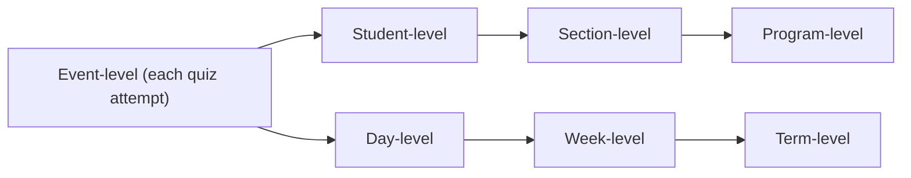

<div class="muted">
Aggregation hides variance; keep distributions when decisions affect individuals.
</div>

<!--
TALK TRACK (≈4–5 min)

Granularity is one of the biggest “silent” decisions in visualization.

At the top left you have event-level data—each quiz attempt, each login, each Wi‑Fi session. That level is detailed but can be overwhelming.

Then you can aggregate to student-level, section-level, or program-level. Each level supports different tasks. If your task is intervention for specific students, you eventually need student-level. If your task is policy decisions, program-level might be enough for overview, but you may still need drill-down for accountability.

Time has granularity too: day, week, term. A weekly view might reveal trends; a daily view might reveal spikes. But finer granularity can add noise and false alarms if sample sizes are small.

The key professional point is in the muted line: aggregation hides variance. When decisions affect individuals—like identifying at-risk students—showing only averages can be unethical and misleading. You often need distributions, counts, and uncertainty.

So when you choose granularity, tie it back to tasks. That’s how you justify what level you aggregated to.
-->

---
layout: two-cols
---

# Reshaping for Visualization

::left::
**Wide** (one row per student)

| student | quiz1 | quiz2 | quiz3 |
|---|---:|---:|---:|
| A | 7 | 8 | 6 |

::right::
**Long / tidy** (one row per observation)

| student | quiz | score |
|---|---|---:|
| A | quiz1 | 7 |
| A | quiz2 | 8 |
| A | quiz3 | 6 |

<!--
TALK TRACK (≈4 min)

Reshaping is one of the most practical skills you need for visualization.

Wide format is convenient for humans to read in spreadsheets: one row per student, multiple quiz columns. But many visualization and analysis workflows prefer long or tidy format: one row per observation, with a variable that indicates which quiz and a column for the score.

Why does tidy data matter? Because it makes grouping, faceting, and filtering consistent. If you want to compare score distributions across quizzes, tidy format lets you write one group-by and one chart specification instead of repeating logic for quiz1, quiz2, quiz3.

In Python, this is where functions like `melt`, `pivot`, and `stack` come in. In the assignment, I expect you to be comfortable reshaping because it’s often required to match the task. For example, “compare trends by section over time” usually needs one row per section-week.

So in your data abstraction, transformations include reshape decisions—not just cleaning. Reshape is how you turn data into chart-ready structure.
-->

---

## Data Quality & Bias (A Fast Checklist)

<v-clicks>

- Missingness: random or systematic? (e.g., absent students)
- Outliers: errors or rare events?
- Units: consistent? (minutes vs hours; ₱ vs $)
- Denominators: use rates when group sizes differ
- Coverage: who is excluded by the data collection process?

</v-clicks>

<!--
TALK TRACK (≈4–5 min)

This checklist is about professional integrity. Visualizations can be beautiful and still wrong if the data has quality issues or bias.

Missingness is not always random. For student data, missing grades might be because students were absent or stopped participating—which is itself a signal. Treating missing as “zero” can be unfair; dropping missing rows can hide the problem.

Outliers can be errors or real rare events. Your job is to investigate, not automatically delete them. If you keep them, you should communicate them clearly.

Units matter. Minutes vs hours, pesos vs dollars—unit mistakes produce nonsense charts. Professional workflow includes explicit unit checks.

Denominators are a fairness issue. Comparing raw counts across differently sized groups misleads. Rates are often the correct derived measure.

Coverage asks who is not represented. LMS data excludes students who access materials offline; Wi‑Fi data excludes those using mobile data. If your dataset systematically excludes a group, your visualization can reinforce bias.

In your projects, I expect you to mention at least one relevant quality or bias consideration. That’s part of being a responsible data visualization practitioner.
-->

---

## Practice 1 (5 minutes): Abstract This Dataset

**Wi‑Fi session log**

Columns: `timestamp`, `student_program`, `access_point`, `session_minutes`, `device_type`

<v-clicks>

- Dataset type(s)?
- Attribute type of each variable?
- One derived measure you might need (rate/ratio/change)?

</v-clicks>

<!--
TALK TRACK (≈3–5 min + activity time)

Let’s practice data abstraction quickly.

You have a Wi‑Fi session log with timestamp, student program, access point, session minutes, and device type. Your job is to write: what dataset type is this primarily? What are the attribute types for each variable? And what derived measure might you need?

Hints: the raw log is a table of events. It becomes temporal if you organize by time. Program and device type are categorical. Session minutes is quantitative. Timestamp is temporal. Access point might be categorical, but it can also be spatial if you have location metadata.

For a derived measure, think about what comparisons might be fair. Total minutes might depend on enrollment size, so minutes per student or sessions per student could be more meaningful. You might also want week‑over‑week change.

Take five minutes to write your answers. Then I’ll ask two groups to share, and we’ll quickly correct any type mistakes—because those mistakes are exactly what would break your visualization later.
-->

---
layout: section
---

<div class="kicker">Part 2 · Tasks</div>

# <span class="gradient-text">Task Abstraction</span>

From domain questions → **actions + targets + constraints**

<!--
TALK TRACK (≈3–4 min)

Now we shift to task abstraction. If data abstraction answers “what do we have?”, task abstraction answers “what does someone need to do?”

This is where we stop accepting vague requests like “make a dashboard” or “use a line chart.” Those are solutions, not tasks. A task is an action performed on a target, under constraints, producing an output.

Why is this so important? Because tasks are what users care about. Users don’t wake up wanting a bar chart—they want to compare, detect, explain, or decide. If your visualization doesn’t support the task, it doesn’t matter how polished it looks.

Task abstraction also helps you avoid overbuilding. If the task is “rank programs by pass rate,” you might only need a sorted dot plot. If the task is “explore and drill down,” you might need filters and details on demand. Different tasks justify different interactions.

So in this section, we’ll build a vocabulary of action verbs, targets, and goals, and we’ll practice rewriting chart requests into task statements. This is the core skill that makes your design defensible.
-->

---

## Task Abstraction: What You Produce

<div class="callout mt-6 text-3xl font-700">
  Action + Target + Constraints + Output
</div>

<v-clicks>

- Action: compare, rank, summarize, detect, locate, filter
- Target: items, groups, attributes, time ranges, links
- Constraints: “this term only”, “by program”, “top 5 sections”
- Output: “a ranked list”, “a time window”, “a set of flagged outliers”

</v-clicks>

<!--
TALK TRACK (≈4–5 min)

This formula—Action + Target + Constraints + Output—is the most useful writing tool in the whole lecture.

Start with the action verb. “Compare,” “rank,” “detect,” “locate,” “summarize,” “filter.” A good action verb forces clarity.

Then name the target. Are you acting on items, groups, attributes, time ranges, or links? “Compare sections,” “rank programs,” “detect drops in weekly average score,” “locate the week where attendance declines.”

Then add constraints. This is where you specify scope and baseline: “this term only,” “compared to last term,” “top 5 only,” “only first-year students.” Constraints prevent the task from being vague.

Finally, define an output that can be verified. “Return a ranked list,” “flag the weeks,” “identify the top three sections,” “produce a filtered subset for drill-down.” If the output can’t be checked, the task is not concrete.

Once you write tasks this way, you can evaluate a visualization quickly: can a user do the action on the target within the constraints and get the output? If not, redesign—starting at the task level, not at the color palette.
-->

---

## Chart Request → Task Statement (Rewrite)

<v-clicks>

- ❌ “Make a bar chart of programs”  
  ✅ “Compare programs by **pass rate** this term”
- ❌ “Use a line chart for quizzes”  
  ✅ “Detect **when** quiz performance drops and **which sections** drop the most”
- ❌ “Create a dashboard with filters”  
  ✅ “Enable **browsing** by program and **drill-down** to student-level details on demand”

</v-clicks>

<!--
TALK TRACK (≈4 min)

This is the rewrite move I want you to practice.

“Make a bar chart of programs” is not a task. It doesn’t tell you what to compare or why. When we rewrite it as “compare programs by pass rate this term,” we have an action (compare), a target (programs), and a measure (pass rate). Now the chart is a consequence.

“Use a line chart for quizzes” is also chart-first. If the real need is “detect when quiz performance drops and which sections drop the most,” the task becomes detection and comparison. That implies time structure, baselines, and probably an interaction like brushing or filtering.

“Create a dashboard with filters” is vague. Rewriting it as “enable browsing by program and drill-down to student-level details on demand” defines the tasks and even hints at interactions.

Here’s the point: a professional doesn’t fight with the client’s chart request. They translate it into tasks. Then they design something that satisfies the tasks—sometimes with the requested chart, sometimes with a better one.

In the next slide, we’ll use a framework that helps you write tasks consistently.
-->

---

## A Strong Framework: WHY / HOW / WHAT

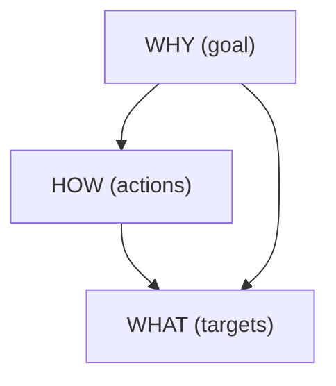

<!--
TALK TRACK (≈3–4 min)

The WHY/HOW/WHAT framework is a compact way to structure task thinking.

WHY is the goal: are we trying to discover something unknown, present a finding, monitor a known metric, or look up a specific value? The goal determines the overall interaction style. Monitoring often needs stable baselines and alerts. Discovery needs flexible filtering and multiple views.

HOW is the action vocabulary: compare, rank, detect, locate, filter, summarize. These verbs become your design requirements. If the verb is “rank,” sorting is essential. If the verb is “detect,” highlighting and annotations help.

WHAT is the target: items, groups, attributes, time ranges, or links. This tells you what needs to be represented visually and what needs to be selectable or filterable.

A practical way to use this is: write a task statement and then label each part as why/how/what. If you can’t label it, the task is probably incomplete.

Next, we’ll make the vocabulary concrete so you can write tasks quickly and consistently.
-->

---

## WHY / HOW / WHAT Vocabulary

<div class="grid grid-cols-3 gap-4 mt-6">
  <div class="card">
    <div class="kicker">WHY (goal)</div>
    <div class="text-xl font-700 mt-2">Motivation</div>
    <ul class="mt-3 text-sm leading-6 op85">
      <li><strong>Discover</strong>: find unknown patterns</li>
      <li><strong>Present</strong>: communicate clearly</li>
      <li><strong>Monitor</strong>: track known metrics</li>
      <li><strong>Lookup</strong>: answer a specific question</li>
    </ul>
  </div>

  <div class="card">
    <div class="kicker">HOW (actions)</div>
    <div class="text-xl font-700 mt-2">Verbs</div>
    <ul class="mt-3 text-sm leading-6 op85">
      <li><strong>Search</strong>: lookup · locate · browse · explore</li>
      <li><strong>Query</strong>: filter · sort · group</li>
      <li><strong>Compare</strong>: rank · contrast · benchmark</li>
      <li><strong>Detect</strong>: outliers · change points</li>
    </ul>
  </div>

  <div class="card">
    <div class="kicker">WHAT (targets)</div>
    <div class="text-xl font-700 mt-2">Objects</div>
    <ul class="mt-3 text-sm leading-6 op85">
      <li><strong>Items</strong>: student, section, record</li>
      <li><strong>Groups</strong>: program, cohort</li>
      <li><strong>Attributes</strong>: score, pass_rate, minutes</li>
      <li><strong>Ranges</strong>: week 3–6, pre/post event</li>
      <li><strong>Links</strong>: prereq, collaboration, referral</li>
    </ul>
  </div>
</div>

<!--
TALK TRACK (≈4–5 min)

This slide is basically your word bank for writing strong task statements.

For WHY, notice the difference between discover and monitor. Discover is exploratory: you don’t know what you’ll find. Monitor is operational: you know what metric matters and you need to see when it changes. Present is about communicating to others with minimal ambiguity. Lookup is about answering a specific question quickly.

For HOW, the verbs are what drive interaction design. Search verbs like browse and explore suggest navigation and filtering. Query verbs suggest controls like filters and sort. Compare verbs suggest alignment and ordering. Detect verbs suggest highlighting, thresholds, and annotations.

For WHAT, be explicit. Many weak tasks fail because they never name the target. “Analyze performance” is vague. “Compare section-level pass rates by week” names groups, a measure, and time.

In your own work, keep this vocabulary close. When you’re stuck, choose a goal (WHY), choose an action (HOW), and choose a target (WHAT). Then your task statement writes itself.
-->

---

## Decompose the Running Example Into Subtasks

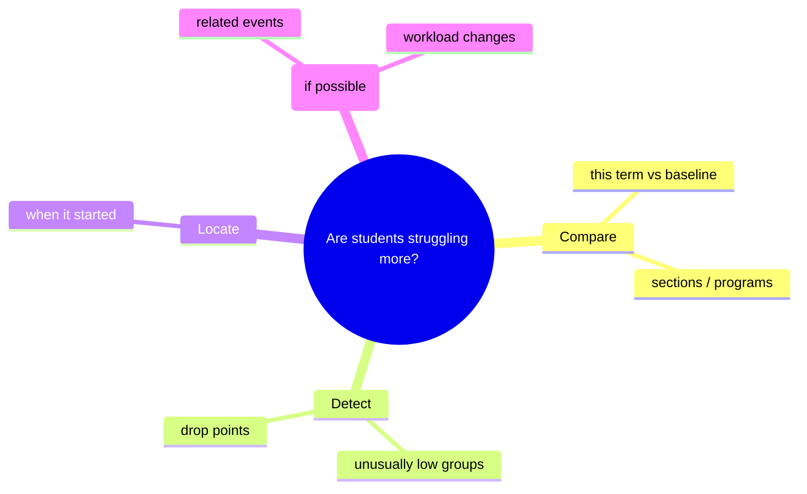

<!--
TALK TRACK (≈4–5 min)

This mindmap shows a professional move: decomposing a big question into smaller tasks.

“Are students struggling more?” is not a single task. It contains comparison: this term versus a baseline, and across sections or programs. It contains detection: find drop points and unusually low groups. It contains locating: when did it start. And sometimes it contains explanation: what events or workload changes might be related.

Each subtask suggests different views. Comparison often suggests aligned charts and sorting. Detection suggests outlier highlighting and thresholds. Locate suggests time-series views and annotations. Explanation often requires additional data and sometimes modeling—notice the “if possible,” because not all explanations are supported by the available data.

When you decompose tasks, you’re also deciding what your visualization will and won’t claim. A good visualization can show patterns; it may not prove causation. Being explicit about that is part of professional honesty.

So when you approach a project, don’t start with “dashboard.” Start by listing subtasks like this. Then you can design a set of views and interactions that cover them.
-->

---

## Search Tasks: Lookup → Explore

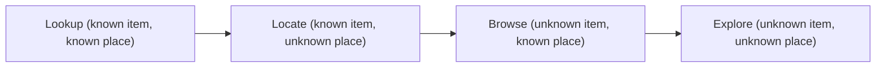

<v-clicks>

- Shneiderman: **overview first → zoom/filter → details on demand**

</v-clicks>

<!--
TALK TRACK (≈4 min)

Search tasks range from very specific to very open-ended.

Lookup is when you know what you want and where it is—like “what is Section A’s pass rate this week?” Locate is when you know the item but not where it appears—like “where in the timeline did the drop start?” Browse is when you don’t know the exact item but you know where to look—like “show me sections in this program.” Explore is when both are unknown—you’re scanning for surprising patterns.

Different points on this spectrum justify different interfaces. Lookup can be a simple table or a single chart with tooltips. Explore might need multiple coordinated views and filters.

This is where Shneiderman’s mantra fits: overview first, then zoom and filter, then details on demand. It’s a design pattern that aligns with human cognition and prevents users from getting lost.

In the running example, we likely want an overview of trends across sections, then the ability to filter to a program, and then details for a specific section or student group.
-->

---

## Compare Tasks: Three Common Patterns

<v-clicks>

- **Compare categories:** section A vs B (use aligned scales; sort when needed)
- **Rank:** top/bottom N (make ordering explicit; show ties)
- **Benchmark:** compare to a target (add reference lines/bands)

</v-clicks>

<div class="muted mt-4">
If comparison is the task, design for *alignment* and *readable differences*.
</div>

<!--
TALK TRACK (≈4–5 min)

Comparison is one of the most common tasks in data visualization, and it’s also one of the easiest to do poorly.

Comparing categories means you want to see differences between groups. The professional rule is alignment: use the same scale, same axis, and ideally a sorted order so differences are easy to see.

Ranking is a specific kind of comparison. If the task is “top 5” or “bottom 5,” your design must make ordering explicit. Sorting is not optional; it’s part of the task. Also be careful with ties and small sample sizes—ranking noisy data can mislead.

Benchmarking compares to a target. This is where reference lines and bands are powerful. If the target pass rate is 75%, show that line. If there’s an acceptable range, show a band.

If you remember one phrase: if comparison is the task, design for readable differences. That means position over color for precision, consistent scales, and intentional ordering.
-->

---

## Distribution Tasks: “What’s Typical?” + “Who Is Different?”

<v-clicks>

- Ask for: center, spread, skew, outliers
- Use: histogram (shape), box plot (summary), violin (density)
- Don’t hide the distribution behind a single average when decisions affect people

</v-clicks>

<!--
TALK TRACK (≈4–5 min)

When the task is about what’s typical and who is different, distributions matter.

Averages can be dangerously comforting. Two groups can have the same average score but very different spreads—one might be consistent, another might have many struggling students and many high performers. If a decision affects individuals, hiding distribution is not just a technical mistake; it can be an ethical mistake.

Histograms show shape—skew, multimodality. Box plots summarize center and spread quickly. Violin plots show density, but they can be harder to read, so use them when the audience is ready.

In the running example, if the Dean wants to know whether students are struggling more, a distribution view can reveal whether the decline is broad-based or concentrated in a subset of students.

A professional habit: pair distribution with sample size. A narrow distribution with n=10 is not the same as with n=200.
-->

---

## Relationship Tasks: Correlate, Cluster, or Explain?

<v-clicks>

- **Correlate:** do two measures move together?
- **Cluster:** do groups form naturally (segments)?
- **Explain:** what factors predict an outcome? (needs modeling + careful claims)
- Reminder: correlation ≠ causation; check confounders and sampling bias

</v-clicks>

<!--
TALK TRACK (≈4–5 min)

Relationship tasks are where people most often overclaim.

Correlation is about whether two measures move together. Visualization can suggest correlation, but you still need to think about scale, outliers, and whether the relationship is driven by a third variable.

Clustering is about whether groups form naturally. Visualizations like scatterplots, heatmaps, or dimensionality-reduction plots can help, but the story depends on preprocessing and metrics.

Explanation is the strongest claim: what factors predict an outcome. That’s usually beyond visualization alone—it requires modeling, validation, and careful language. The point of this slide is to remind you to separate “we observe an association” from “we know the cause.”

For our student example, you might see that low attendance correlates with low quiz scores. That’s useful for intervention, but you should not immediately claim attendance causes low scores without more evidence.

Professional credibility comes from making the strength of your claim match the strength of your evidence.
-->

---

## Tasks ↔ Interactions (Design on Purpose)

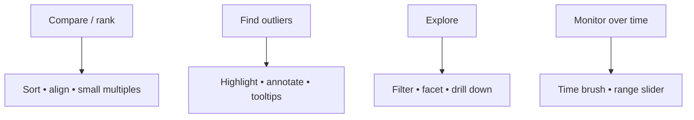

<!--
TALK TRACK (≈4 min)

Interactions are not decoration. They exist to support tasks.

If the task is compare or rank, sorting and alignment are your best friends. Small multiples can help comparisons across many groups because they preserve consistent scales.

If the task is to find outliers, highlighting, annotations, and tooltips help users confirm and interpret unusual points.

If the task is exploration, filters, faceting, and drill-down let users narrow the space and then get details on demand.

If the task is monitoring over time, time brushing and range selection are common patterns because they let you focus on the relevant window.

When you add an interaction, you should be able to say: “This interaction exists because it supports this task.” If you can’t say that, remove it. Minimal, purposeful interaction is what makes a design feel professional.
-->

---

## Task Quality Rubric (For Reports and Projects)

<v-clicks>

- Uses a clear **action verb** (compare/rank/detect…)
- Names an explicit **target** (items/groups/attributes/time range)
- States constraints (population/timeframe/baseline)
- Produces an **output** that someone can verify (ranked list, flagged cases, chosen window)

</v-clicks>

<!--
TALK TRACK (≈3–4 min)

This rubric is how I evaluate task statements, and it’s also how you should self-check.

A strong task uses a clear verb. “Understand” is not a verb I can design for; “compare,” “rank,” “detect,” and “locate” are.

A strong task names a target. If you don’t specify what you’re acting on—items, groups, attributes—the task stays vague and you can’t evaluate whether the visualization succeeds.

A strong task states constraints and baselines. “This term vs last term” is a constraint and a baseline. “Top 5 sections” is a constraint. Constraints make a task realistic.

Finally, a strong task produces an output that someone can check. “Gain insight” is not checkable. “Flag weeks where pass rate drops below 70%” is checkable.

If you write tasks this way, your visualization design becomes much easier to justify—and you can explain your reasoning like a professional.
-->

---

## Practice 2 (7 minutes): Write Two Task Statements

Pick one dataset from Practice 1 and write:

<v-clicks>

1. One **monitoring** task (ongoing tracking)
2. One **discovery** task (exploration)

</v-clicks>

Use: **Action + Target + Constraints + Output**

<!--
TALK TRACK (≈3–5 min + activity time)

Second practice: task abstraction.

Pick one dataset idea—either the Wi‑Fi log from earlier or any dataset you’re comfortable with. Write two task statements.

First, write a monitoring task: something you would track over time, with a baseline or threshold. Example: “Monitor weekly average session minutes by program this term and flag weeks where a program drops more than 15% from baseline.”

Second, write a discovery task: something exploratory, where you’re looking for patterns or anomalies. Example: “Explore which access points have unusually long sessions and identify whether the pattern differs by device type.”

Use the exact format: action + target + constraints + output. If you get stuck, use the WHY/HOW/WHAT vocabulary slide as a word bank.

I’ll give you seven minutes. After that, we’ll read a couple of task statements and I’ll help tighten them. The goal is to make the tasks specific enough that a visualization can be evaluated against them.
-->

---
layout: section
---

<div class="kicker">Part 3 · Design</div>

# <span class="gradient-text">Putting It Together</span>

From abstractions → justified visualization designs

<!--
TALK TRACK (≈3–4 min)

We’ve built the two foundations: data abstraction and task abstraction. Now we connect them to design.

This is where your work should start to feel like professional data visualization practice. We’re no longer just listing types—we’re using those abstractions to justify why a particular view, scale, and interaction exists.

I want you to notice a theme: when a visualization fails, the fix is often not “change the chart.” The fix is: clarify the task, fix the data spec, or choose the correct granularity. Once those are correct, the encoding choices become much more obvious.

In this final section, I’ll give you a simple worksheet you can reuse in projects, then we’ll add a quick bridge from abstraction to encoding, and then we’ll walk through two short case studies—one table + time example and one network example.

As we go, keep asking: if someone challenged this design, could I defend it using tasks and data? That’s the professional standard.
-->

---

## The 4-Step Abstraction Worksheet (Use This Every Time)

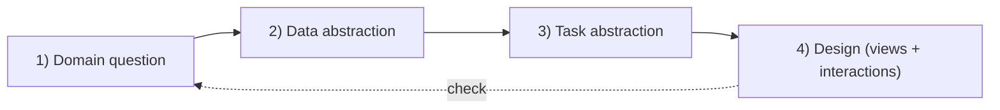

<!--
TALK TRACK (≈4 min)

This is a repeatable workflow you can use for any visualization project in this course.

Step 1: write the domain question in one sentence. If you can’t write it, you don’t understand the problem yet.

Step 2: data abstraction. Declare dataset types, variable types, and transformations you need. This is where you catch missing baselines and missing identifiers early.

Step 3: task abstraction. Write the tasks as action + target + constraints + output. If the tasks are vague, the design will be vague.

Step 4: design. Choose views and interactions that directly support the tasks on the given data structure.

The loop back to the domain question is the evaluation step. After you draft a design, ask: does it actually answer the domain question? If not, don’t just tweak styling—revisit the earlier steps.

If you follow this worksheet, your projects will be more coherent, and your design decisions will be easier to explain.
-->

---
layout: two-cols
---

# Channel Effectiveness

::left::
<div class="card">
  <div class="kicker">Rule of thumb</div>
  <div class="op80 mt-2 text-sm">Most precise → least precise</div>
</div>

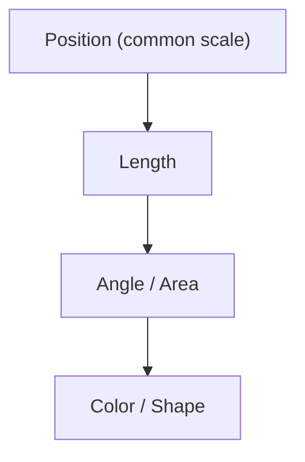

<div class="muted mt-2 text-sm">
If the task is comparison, prioritize <strong>position</strong> and <strong>alignment</strong>.
</div>

::right::
<div class="card">
  <div class="kicker">Design implications</div>
  <div class="op80 mt-2 text-sm">How this changes chart choices</div>
</div>

<ul class="mt-3 text-sm leading-5 op85">
  <li><strong>Ranking / comparison</strong> → dot plots, sorted bars, small multiples</li>
  <li><strong>Magnitude</strong> → avoid area-only encodings for precision</li>
  <li><strong>Categories</strong> → use hue for grouping, not “how much”</li>
  <li><strong>Many groups</strong> → sort + label; reduce legend hunting</li>
</ul>

<!--
TALK TRACK (≈4–5 min)

This slide is a bridge from abstraction to actual encoding decisions by focusing on channel effectiveness.

The idea is simple: some visual channels are better for precise comparison than others. If your task is “compare” or “rank,” you want users to see small differences quickly and correctly.

Position on a common scale is the most accurate channel. That’s why dot plots and line charts—when used correctly—are so effective. Length is also strong, which is why bars work when the baseline is meaningful.

Angle and area are weaker for precise comparison. Pie charts and bubble charts often look nice, but they make it harder to read small differences accurately. Color is great for grouping, but it is not a precise quantitative scale unless carefully controlled, and even then it’s usually weaker than position.

So the professional implication is: let the task guide the channel. If the task is ranking sections by pass rate, choose an encoding where ranking is immediately legible—like a sorted dot plot. If the task is comparing time trends, use aligned axes and avoid encodings that make people estimate differences by area.

This is why good visualizations often look “simple”: they’re optimized for the task, not for novelty.
-->

---
layout: two-cols
---

# Match Encoding to Type

::left::
<div class="card">
  <div class="kicker">Abstraction → safe channels</div>
  <div class="op80 mt-2 text-sm">Attribute types constrain what encodings mean.</div>
</div>

<ul class="mt-3 text-sm leading-6 op85">
  <li><strong>Quantitative</strong> → position / length for comparison</li>
  <li><strong>Ordinal</strong> → position or ordered lightness</li>
  <li><strong>Categorical</strong> → hue, shape, grouping</li>
  <li><strong>Temporal</strong> → position on x + ordering</li>
</ul>

<div class="muted mt-2 text-sm">
If the type is wrong, the chart is wrong—even if it looks polished.
</div>

::right::
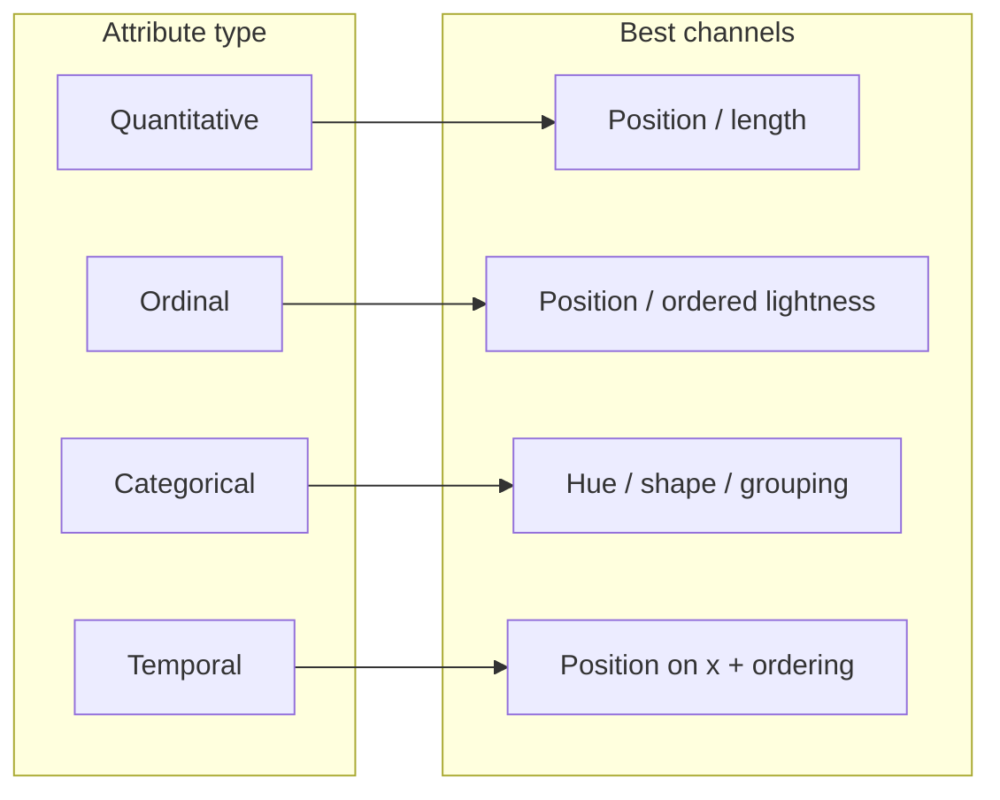

<!--
TALK TRACK (≈4–5 min)

This slide connects data abstraction directly to encoding decisions.

Once you label a variable as quantitative, ordinal, categorical, or temporal, you are also deciding what visual channels will preserve meaning.

Quantitative variables represent magnitude, so position and length are the safest channels for comparison. Ordinal variables are ranked categories, so they need encodings that preserve order—position or ordered lightness. Categorical variables represent different kinds, so hue, shape, and grouping work best. Temporal variables represent time, so they naturally map to an ordered x‑axis.

This matters because many misleading charts come from type mistakes. If you treat a category code as a number and put it on a quantitative axis, you’re inventing a false ordering. If you encode quantitative comparisons using random hues, you’re forcing the audience to guess magnitudes.

So the professional workflow is: decide the type first, then choose channels that match the type and the task. When you can explain that mapping, your design becomes trustworthy.
-->

---

## Evaluation Checklist (Before You Submit a Viz)

<div class="grid grid-cols-2 gap-4 mt-4">
  <div class="card">
    <div class="kicker">Tasks</div>
    <ul class="mt-3 text-sm leading-5 op85">
      <li>Action verb is explicit (compare/rank/detect…)</li>
      <li>Target + baseline are named</li>
      <li>Output is verifiable (top‑5 list, flagged weeks…)</li>
    </ul>
  </div>
  <div class="card">
    <div class="kicker">Data</div>
    <ul class="mt-3 text-sm leading-5 op85">
      <li>Types + units are correct</li>
      <li>IDs are stable; joins are valid</li>
      <li>Denominators are handled (rates vs counts)</li>
    </ul>
  </div>
  <div class="card">
    <div class="kicker">Design</div>
    <ul class="mt-3 text-sm leading-5 op85">
      <li>Aligned scales for comparisons</li>
      <li>Legible labels, annotations, and legends</li>
      <li>Uncertainty + missingness are disclosed</li>
    </ul>
  </div>
  <div class="card">
    <div class="kicker">Iteration</div>
    <ul class="mt-3 text-sm leading-5 op85">
      <li>Test with 2–3 real task questions</li>
      <li>Revise at the abstraction level first</li>
      <li>Then adjust encodings/interactions</li>
    </ul>
  </div>
</div>

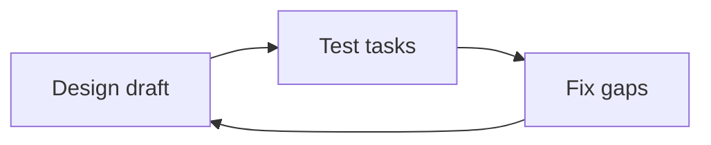

<!--
TALK TRACK (≈4–5 min)

This is what professional QA looks like for a visualization.

First, tasks: can someone actually perform the action you claimed? If the task is ranking, is it sortable and is the ordering clear? If the task is detecting change, are change points legible and is the baseline visible?

Second, data: are types and units correct? Are joins valid? Are you comparing rates instead of raw counts when group sizes differ?

Third, design: are scales aligned? Are labels readable? Did you accidentally hide uncertainty or missingness?

Finally, iteration: test with real task questions. Literally ask: “Which program declined the most?” “When did the drop start?” If your visualization can’t answer these in under a minute, revise.

The cycle diagram is the mindset: draft, test, fix gaps, and iterate. And note that “fix gaps” often happens at the abstraction level. If you’re missing a baseline, no amount of styling will fix the problem. You need different data or a different task statement.
-->

---

## Case Study: Student Performance (A Task-Driven Design)

<v-clicks>

- **Data abstraction:** table of section-week records  
  Variables: section (cat), week (temp), avg_score (quant), pass_rate (quant), n_students (quant)
- **Key tasks:** compare sections, detect drops, locate weeks, drill down to details

</v-clicks>

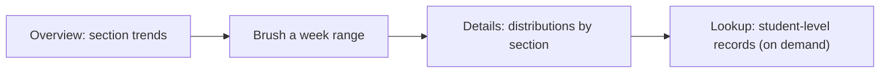

<!--
TALK TRACK (≈5 min)

Let’s apply the worksheet to a realistic design.

Data abstraction: we choose a primary structure—a table of section‑week records. That gives us time (week), categories (section), and quantitative measures (avg_score, pass_rate, n_students). We can still keep student-level data separately for drill-down, but the overview is aggregated.

Task abstraction: compare sections, detect drops, locate when a decline begins, and then drill down to understand the distribution and who is affected.

Design: start with an overview of section trends. This is often small multiples or a line chart with grouping, but the key is consistent scales. Then add a time brush so the user can focus on a window—say weeks 4–6. Then show details: distributions by section in that window, not just averages. Finally, allow lookup of student-level records on demand, because that supports investigation without overwhelming the overview.

Notice how each view and interaction maps to a task. The brush exists because the task includes “locate when it started.” The distribution view exists because the task includes “how much worse” and we don’t want to hide variance.

This is what “defensible design” looks like: a clear chain from tasks to views.
-->

---

## Case Study: Collaboration Network (Different Data, Different Tasks)

<v-clicks>

- **Data abstraction:** network (nodes=orgs, links=collaborations), link weight=quant
- **Tasks:** find hubs, bridge orgs, communities; compare before/after an event
- **Design hint:** combine network view with a sortable table for reliable ranking

</v-clicks>

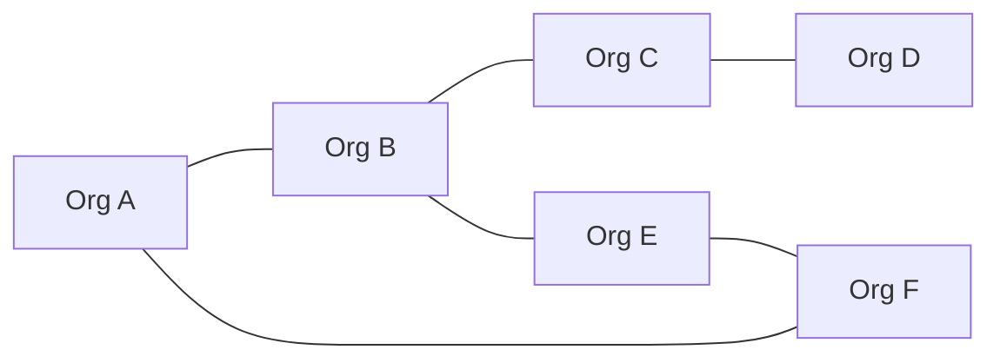

<!--
TALK TRACK (≈5 min)

This case study shows why dataset type matters. If you change the data structure, the task set changes, and the design changes.

Here the data abstraction is a network: nodes are organizations, links are collaborations, and link weight is quantitative. Typical tasks are finding hubs (high-degree nodes), finding bridges (nodes connecting communities), and detecting communities. You might also compare the network before and after an event.

A key professional point: network diagrams are visually appealing but can be unreliable for precise comparisons. A force-directed layout can move around and make it hard to compare weights or rankings.

That’s why the design hint matters: combine a network view with a sortable table. The network gives structure and context, while the table provides accurate ranking and values. This combination supports both exploration and precise comparison.

Again, notice the abstraction chain: because the data is a network, tasks include connectivity and community. Because tasks include ranking, you provide an aligned, sortable view.
-->

---

## Key Takeaways

<v-clicks>

- Abstraction is the bridge from **domain** to **design**
- Data abstraction: dataset types + attribute types + transformations
- Task abstraction: goals + actions + targets (+ constraints + output)
- Good charts are **defensible** because they directly support tasks
- Avoid common failures: type mixing, raw counts without denominators, over-aggregation, vague tasks

</v-clicks>

<!--
TALK TRACK (≈3–4 min)

Let’s lock in the main points.

Abstraction is the bridge from domain to design. If you can’t defend your chart choice, you probably skipped abstraction.

Data abstraction means you can name dataset types, variable types, and required transforms. It includes granularity choices, derived measures, and tidy structure—not just “cleaning.”

Task abstraction means you can write what the visualization must enable: action + target + constraints + output. Tasks are not charts.

When you design based on tasks and data, your work becomes defensible. You can explain it like a professional: “I used position and sorting because the task is ranking,” or “I used brushing because the task includes locating a time window.”

Finally, the common failures are predictable: mixing types, using raw counts when group sizes differ, aggregating too early and hiding variance, and writing vague tasks. If you can avoid these, your visualizations will immediately look more credible.
-->

---

## Exit Ticket + References

**Exit ticket (answer in 2–3 sentences each)**
1. What is the dataset type and attribute types for your chosen example?
2. Write one task as **Action + Target + Constraints + Output**
3. What interaction would most help that task, and why?

**References**
- Munzner, *Visualization Analysis & Design*
- Brehmer & Munzner (2013), abstract task typology
- Wickham (2014), tidy data

Marc Reyes · `marc.reyes@dlsu.edu.ph`

<!--
TALK TRACK (≈3–5 min)

Before we end, here’s a quick exit ticket. This is not busywork—it’s the same reasoning process you’ll use in projects.

For question 1, describe the dataset type and variable types for your chosen example. Be explicit: “table of section-week records,” “categorical section,” “temporal week,” “quantitative pass_rate,” and so on.

For question 2, write one task in the exact format: action + target + constraints + output. If you write “analyze performance,” I will ask you to rewrite it. Make it testable.

For question 3, choose one interaction and justify it. For example, if your task is comparing, you might choose sorting. If your task is locating a time window, you might choose a brush. The justification should connect directly to the task.

The references at the bottom are the sources behind today’s framework. If you want to go deeper, Munzner is the core text. Brehmer & Munzner formalize task typology. Wickham’s tidy data is the foundation for reshaping and transforms.

After this, I’ll introduce the Python assignment that applies the same workflow.
-->

---

## Python Assignment (Take-Home): Abstraction → Design

<div class="callout mt-6">
  <div class="kicker">Goal</div>
  <div class="text-2xl font-700 mt-2">Turn a domain question into a defendable visualization workflow.</div>
</div>

<div class="grid grid-cols-2 gap-4 mt-6">
  <div class="card">
    <div class="kicker">Write</div>
    <ul class="mt-3 text-sm leading-6 op85">
      <li><strong>1 domain question</strong> (one sentence)</li>
      <li><strong>Data abstraction</strong>: dataset type(s) + variable types</li>
      <li><strong>Task abstraction</strong>: 3 tasks (Action + Target + Constraints + Output)</li>
    </ul>
  </div>
  <div class="card">
    <div class="kicker">Build (Python)</div>
    <ul class="mt-3 text-sm leading-6 op85">
      <li><strong>Transforms</strong>: clean, tidy/reshape, derive measures</li>
      <li><strong>2 charts</strong> that directly support your tasks</li>
      <li><strong>Justification</strong>: 4–6 sentences mapping choices to tasks</li>
    </ul>
  </div>
</div>

```mermaid {scale: 0.7}
flowchart LR
  Q["Domain question"] --> TA["Tasks (3+)"]
  TA --> DA["Data abstraction<br/>(types + vars)"]
  DA --> TR["Transforms<br/>(clean · tidy · derive)"]
  TR --> V["Visual design<br/>(2 charts +<br/>justification)"]
```

<!--
TALK TRACK (≈5 min)

This assignment is designed to prove you can apply abstraction, not just repeat definitions.

Step 1: write one domain question. Keep it realistic and specific. For example: “Which sections show the largest decline in quiz performance after midterms compared to last term?”

Step 2: write the data abstraction. Name dataset types, list variables with attribute types, and identify what transformations you will need. If you need a baseline dataset, say so.

Step 3: write three task statements using action + target + constraints + output. At least one task should be comparison or ranking, and at least one should involve time or distribution if appropriate.

Step 4: implement in Python. Clean, reshape to tidy format, derive measures like rates or percent change, and produce two charts that directly support your tasks.

Finally, write a short justification mapping each chart choice to a task. That’s what makes the work defensible.

If you don’t have your own dataset, you can use a public dataset or a class dataset—just make sure your data and tasks actually match. The grading is based on correctness of abstraction and clarity of the mapping, not on “fancy visuals.”
-->

---

## Starter Code + Deliverables

```python
import pandas as pd

df = pd.read_csv("your_data.csv")

# 1) Data abstraction: fix types (example)
# df["date"] = pd.to_datetime(df["date"])

# 2) Transforms: tidy + aggregate for a task
result = (
    df.dropna()
      .groupby(["group", "time"], as_index=False)
      .agg(value=("value", "mean"), n=("value", "size"))
)
```

<div class="grid grid-cols-2 gap-4 mt-6">
  <div class="card">
    <div class="kicker">Submit</div>
    <ul class="mt-3 text-sm leading-6 op85">
      <li><code>abstraction.md</code> (data spec + task statements)</li>
      <li><code>analysis.ipynb</code> (transforms + charts)</li>
      <li>Export charts as <code>.png</code> or <code>.svg</code></li>
    </ul>
  </div>
  <div class="card">
    <div class="kicker">Rubric (simple)</div>
    <ul class="mt-3 text-sm leading-6 op85">
      <li>Correct types + meaningful derived measures</li>
      <li>Tasks are specific and verifiable</li>
      <li>Charts clearly support tasks (not “favorite charts”)</li>
    </ul>
  </div>
</div>

<!--
TALK TRACK (≈4–5 min)

This slide tells you exactly what to submit and gives you a safe starting structure in pandas.

The starter code is intentionally generic: load a CSV, fix types, drop or handle missing values, then group and aggregate based on a task. In your actual notebook, you should replace `group`, `time`, and `value` with your real column names, and you should explicitly set dtypes where needed—especially dates and categories.

The key deliverable is not only the charts. It’s also `abstraction.md`, where you write your data spec and task spec. Think of it as your design brief.

For the notebook, I expect to see the transformation steps clearly: cleaning, reshaping, deriving measures, and then plotting. Don’t jump straight to the chart without showing how the data became chart-ready.

Export your charts as images so I can view them quickly, and keep your justification short but specific: “This chart supports Task 2 (rank programs by pass_rate) by using position and sorting with a shared scale.”

If you follow the worksheet from earlier, this assignment becomes straightforward: abstraction first, then design.
-->
