# Data & Task Abstraction

A practical framework for translating domain questions into defensible visual designs.

<div class="absolute bottom-10 left-14 leading-tight">
  <div class="text-xl font-700">Marc Reyes</div>
  <div class="op70">Professional Lecturer · marc.reyes@dlsu.edu.ph</div>
  <div class="op70">DATA101 — De La Salle University</div>
</div>

---

## Today’s Plan (90 minutes)

<div class="grid grid-cols-2 gap-4 mt-5">
  <div class="card">
    <div class="kicker">01 · Setup</div>
    <div class="text-2xl font-700 mt-1">Why abstraction matters</div>
    <div class="op70 mt-2">Avoid the chart‑first trap.</div>
  </div>
  <div class="card">
    <div class="kicker">02 · Data</div>
    <div class="text-2xl font-700 mt-1">Dataset + attribute types</div>
    <div class="op70 mt-2">What you have, what it means.</div>
  </div>
  <div class="card">
    <div class="kicker">03 · Tasks</div>
    <div class="text-2xl font-700 mt-1">Goals + actions + targets</div>
    <div class="op70 mt-2">What your user needs to do.</div>
  </div>
  <div class="card">
    <div class="kicker">04 · Design</div>
    <div class="text-2xl font-700 mt-1">From abstraction → charts</div>
    <div class="op70 mt-2">Views + interactions you can defend.</div>
  </div>
  <div class="card col-span-2">
    <div class="kicker">05 · Practice</div>
    <div class="text-2xl font-700 mt-1">Exercises + exit ticket + Python assignment</div>
    <div class="op70 mt-2">Write abstractions like a practitioner (then implement in pandas).</div>
  </div>
</div>

---

## Learning Outcomes

<div class="grid grid-cols-2 gap-4 mt-8">
  <div class="card">
    <div class="kicker">Data</div>
    <div class="text-xl font-700 mt-1">Identify dataset structure</div>
    <div class="op70 mt-2">Table, time series, spatial, network, hybrid…</div>
  </div>
  <div class="card">
    <div class="kicker">Data</div>
    <div class="text-xl font-700 mt-1">Label attribute types</div>
    <div class="op70 mt-2">Categorical, ordinal, quantitative, temporal.</div>
  </div>
  <div class="card">
    <div class="kicker">Tasks</div>
    <div class="text-xl font-700 mt-1">Write task statements</div>
    <div class="op70 mt-2">Action + Target + Constraints + Output.</div>
  </div>
  <div class="card">
    <div class="kicker">Design</div>
    <div class="text-xl font-700 mt-1">Justify chart + interaction</div>
    <div class="op70 mt-2">Design decisions that map to data + tasks.</div>
  </div>
</div>

---

## Warm-Up (3 minutes)

<div class="callout mt-6">
  <div class="kicker">Prompt</div>
  <div class="text-2xl font-700 mt-2">“The Dean wants to know if students are struggling more this term.”</div>
</div>

<div class="grid grid-cols-3 gap-4 mt-8">
  <div class="card">
    <div class="kicker">Metric</div>
    <div class="mt-2">Scores? pass rate? attendance? drop rate?</div>
  </div>
  <div class="card">
    <div class="kicker">Baseline</div>
    <div class="mt-2">Last term? last year? another section?</div>
  </div>
  <div class="card">
    <div class="kicker">Output</div>
    <div class="mt-2">Which groups? when? how big? how confident?</div>
  </div>
</div>

---
layout: statement
---

# Abstraction = <span class="gradient-text">translation</span>

From **domain language** → to **general structures** that visualization methods can support.

---

## The Chart-First Trap (and How to Avoid It)

<div class="grid grid-cols-2 gap-4 mt-4">
  <div class="card">
    <div class="kicker">Common failure mode</div>
    <div class="text-xl font-700 mt-2">Chart‑first thinking</div>
    <div class="op70 mt-2">“Make a bar chart” is a solution, not a problem statement.</div>
  </div>
  <div class="card">
    <div class="kicker">Professional workflow</div>
    <div class="text-xl font-700 mt-2">Abstraction‑first thinking</div>
    <div class="op70 mt-2">Question → tasks → data needs → transforms → design.</div>
  </div>
</div>

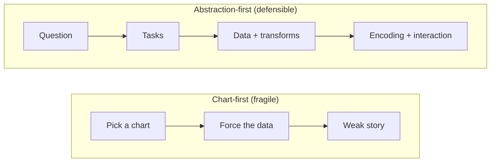

---

## Munzner’s Nested Model (Where Abstraction Lives)

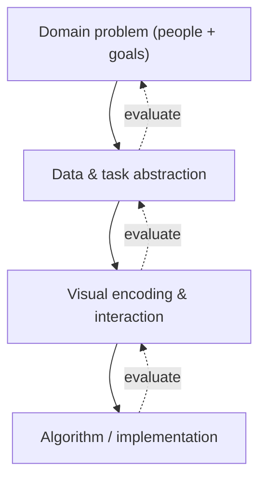

<!-- Speaker note: Design problems often fail because the wrong level was chosen too early.
     If you struggle to pick a chart, revisit data/task abstraction before encoding. -->

---
layout: two-cols
---

# Two Outputs You Should Be Able to Write

<div class="op80 mt-2">
  Before picking charts: write the <strong>task spec</strong> and <strong>data spec</strong>.
</div>

::left::
<div class="card mt-4">
  <div class="kicker">Task abstraction</div>
  <div class="text-xl font-700 mt-1">Why → How → What</div>
</div>

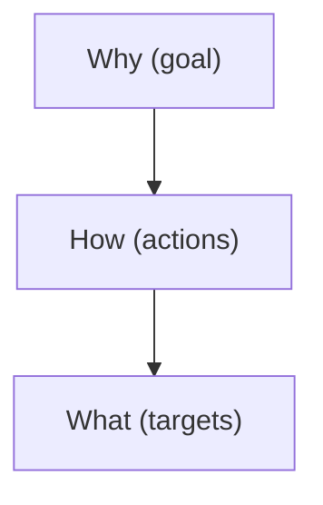

::right::
<div class="card mt-4">
  <div class="kicker">Data abstraction</div>
  <div class="text-xl font-700 mt-1">Types → Variables → Transforms</div>
</div>

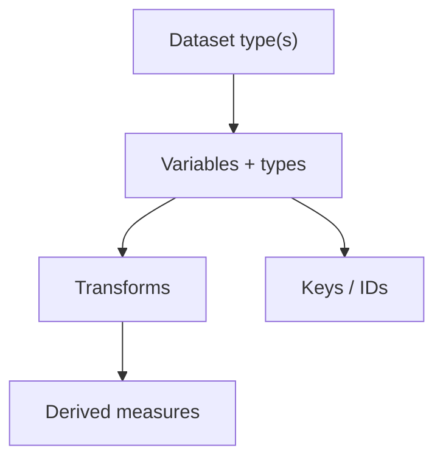

---

## Running Example (We’ll Use This All Lecture)

**Question:** “Are students struggling more this term?”

<v-clicks>

- Possible data sources: weekly quizzes, attendance logs, LMS activity, advising records
- Possible unit of analysis: student, section, program, college
- Possible time scale: week, month, midterms/finals phases

</v-clicks>

---

## What a “Good Answer” Looks Like

<div class="kicker mt-2">Success criteria</div>

<div class="grid grid-cols-2 gap-4 mt-6">
  <div class="card">
    <div class="kicker">Target</div>
    <div class="text-2xl font-700 mt-1">Who?</div>
    <div class="op70 mt-2">Which sections/programs are struggling?</div>
  </div>
  <div class="card">
    <div class="kicker">Time</div>
    <div class="text-2xl font-700 mt-1">When?</div>
    <div class="op70 mt-2">Which weeks; before/after which event?</div>
  </div>
  <div class="card">
    <div class="kicker">Magnitude</div>
    <div class="text-2xl font-700 mt-1">How much?</div>
    <div class="op70 mt-2">Show distributions, not just averages.</div>
  </div>
  <div class="card">
    <div class="kicker">Baseline</div>
    <div class="text-2xl font-700 mt-1">Compared to what?</div>
    <div class="op70 mt-2">Last term, target, or benchmark.</div>
  </div>
</div>

---
layout: section
---

<div class="kicker">Part 1 · Data</div>

# <span class="gradient-text">Data Abstraction</span>

From domain data → **dataset types + attribute types + transformations**

---

## Data Abstraction: What You Produce

<div class="callout mt-6 text-2xl font-700">
  Dataset type(s) + attribute types + required transforms
</div>

<v-clicks>

- Dataset type(s): table, time series, spatial, hierarchy, network, field, sets
- “Items” vs “relationships” vs “positions”
- Variable list with attribute types + units
- Required transformations: cleaning, aggregation, binning, derived measures

</v-clicks>

---

## Start With an Inventory (Before Any Charts)

| Question | What you write down |
|---|---|
| What are the **items**? | rows / records (students, sessions, transactions) |
| What are the **variables**? | columns (program, score, week, minutes) |
| Are there **relationships**? | links (prerequisite, collaboration, referral) |
| Are there **positions**? | time order, coordinates, grid cells |

---

## Dataset Types (Visualization Lens)

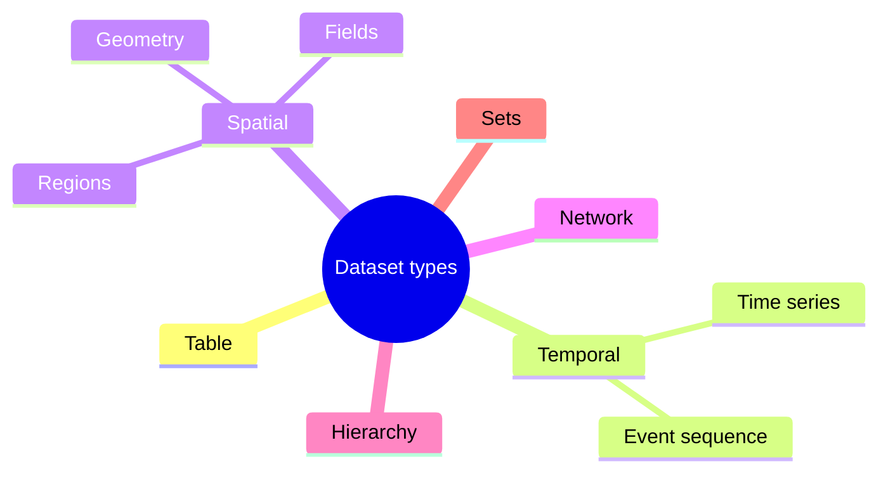

---

## Dataset Type: Table (Items × Attributes)

**Example:** student records

<v-clicks>

- Items: students or section-week records
- Typical transforms: group-by, summarize, sort, filter
- Typical views: bar chart (compare), dot plot (rank), histogram/box plot (distribution)

</v-clicks>

---

## Dataset Type: Time Series (Ordered by Time)

**Common mistakes:** missing weeks, irregular sampling, mixing time zones.

<v-clicks>

- Decide the time unit (day/week/month) and make it explicit
- Consider smoothing carefully (rolling mean can hide spikes)
- Baselines matter: compare to last term or target performance

</v-clicks>

---

## Spatial Data: Geometry vs Regions vs Fields

<v-clicks>

- **Geometry:** points/lines (GPS pings, routes) → proximity, clusters
- **Regions:** polygons (cities/barangays) → compare areas, choropleths (careful with population)
- **Fields:** values everywhere (density/temperature) → heatmaps, contours, binning choices

</v-clicks>

---
layout: two-cols
---

# Hierarchy vs Network (Know the Difference)

::left::
**Hierarchy** (parent → child)

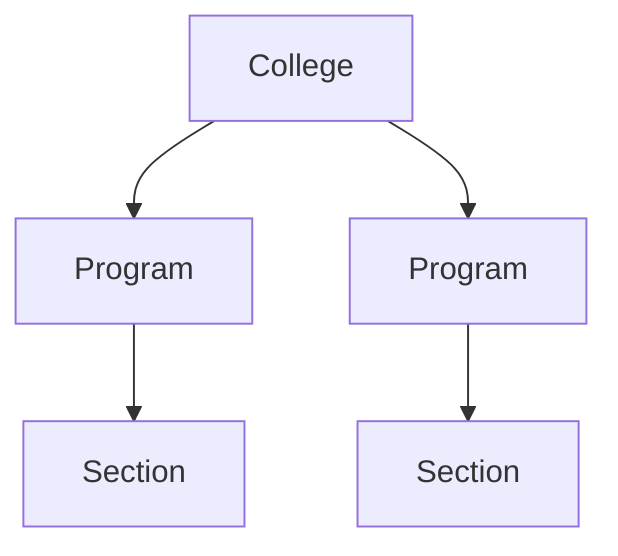

::right::
**Network** (links between peers)


---

## Fields & Density: Why Binning Is a Design Decision

<v-clicks>

- Raw events → bins (grid cells, time windows) → aggregated values
- Bigger bins: smoother but can hide local patterns
- Smaller bins: detailed but noisier; may exaggerate randomness

</v-clicks>

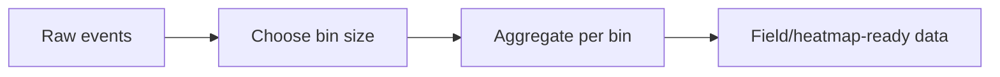

---

## Sets & Membership Data

**When items belong to multiple groups** (e.g., students in orgs + electives).

<v-clicks>

- Dataset structure: items + membership lists
- Typical tasks: overlap, exclusive groups, coverage
- Warning: Venn diagrams don’t scale; consider tables or UpSet-style views

</v-clicks>

---

## Hybrid Datasets (Most Real Problems)

Many datasets are **table + time + category** (and sometimes spatial).

<v-clicks>

- Choose a primary structure (often a table of records)
- Decide whether time/space are axes or attributes; keep stable IDs (student_id, section_id)

</v-clicks>

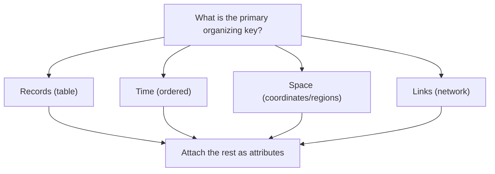

---

## Attribute Types (Semantics of Variables)

<div class="grid grid-cols-2 gap-4 mt-6">
  <div class="card">
    <div class="flex items-baseline justify-between">
      <div class="text-xl font-700">Categorical</div>
      <div class="op70 text-sm">different kinds</div>
    </div>
    <div class="mt-3 op85">Examples: program, device_type</div>
    <div class="mt-2 op70 text-sm">Channels: color hue, shape, grouping</div>
    <div class="mt-4 h-2 rounded-full bg-gradient-to-r from-sky-400 to-violet-400 op80"></div>
  </div>

  <div class="card">
    <div class="flex items-baseline justify-between">
      <div class="text-xl font-700">Ordinal</div>
      <div class="op70 text-sm">ranked kinds</div>
    </div>
    <div class="mt-3 op85">Examples: Likert 1–5, grade bands</div>
    <div class="mt-2 op70 text-sm">Channels: position, ordered color</div>
    <div class="mt-4 h-2 rounded-full bg-gradient-to-r from-gray-500 to-gray-200 op80"></div>
  </div>

  <div class="card">
    <div class="flex items-baseline justify-between">
      <div class="text-xl font-700">Quantitative</div>
      <div class="op70 text-sm">magnitude</div>
    </div>
    <div class="mt-3 op85">Examples: score, minutes, count</div>
    <div class="mt-2 op70 text-sm">Channels: position, length, size</div>
    <div class="mt-4 grid grid-cols-6 gap-1 items-end">
      <div class="h-2 bg-sky-500/70 rounded"></div>
      <div class="h-4 bg-sky-500/70 rounded"></div>
      <div class="h-6 bg-sky-500/70 rounded"></div>
      <div class="h-3 bg-sky-500/70 rounded"></div>
      <div class="h-7 bg-sky-500/70 rounded"></div>
      <div class="h-5 bg-sky-500/70 rounded"></div>
    </div>
  </div>

  <div class="card">
    <div class="flex items-baseline justify-between">
      <div class="text-xl font-700">Temporal</div>
      <div class="op70 text-sm">time</div>
    </div>
    <div class="mt-3 op85">Examples: week, timestamp</div>
    <div class="mt-2 op70 text-sm">Channels: position (x), ordering</div>
    <div class="mt-4 flex items-center gap-2 op80">
      <div class="h-2 w-2 rounded-full bg-sky-400"></div>
      <div class="h-0.5 flex-1 bg-white/20 rounded-full"></div>
      <div class="h-2 w-2 rounded-full bg-sky-400"></div>
      <div class="h-0.5 flex-1 bg-white/20 rounded-full"></div>
      <div class="h-2 w-2 rounded-full bg-sky-400"></div>
    </div>
  </div>
</div>

---

## Measurement Scales (What Math Is Valid?)

| Scale | Example | You can do… | Don’t… |
|---|---|---|---|
| Nominal | program | count, mode | average it |
| Ordinal | rank, Likert | median, order | assume equal gaps |
| Interval | °C | differences | claim “twice as hot” |
| Ratio | counts, ₱ | ratios, % change | ignore units |

---

## Identifiers vs Measures vs Categories

<v-clicks>

- **Identifier:** labels one item (StudentID, SectionCode) → use for joins, not charts
- **Measure:** numeric value with meaning (score, minutes, count) → plot/analyze
- **Category code:** looks numeric but is categorical (1=CS, 2=IT) → treat as categorical

</v-clicks>

<div class="muted mt-4">
Quick test: “If I average this, does the result mean anything?”
</div>

---

## Derived Measures (Often the Real KPI)

<v-clicks>

- Rates: pass_rate = passes / enrolled
- Normalization: incidents per 1,000 students (not raw counts)
- Change: week-over-week difference or percent change
- Composite indices: only if components and weights are justified

</v-clicks>

---

## Granularity & Aggregation (Choose With Tasks)

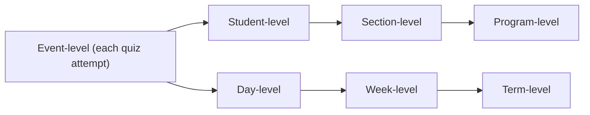

<div class="muted">
Aggregation hides variance; keep distributions when decisions affect individuals.
</div>

---
layout: two-cols
---

# Reshaping for Visualization

::left::
**Wide** (one row per student)

| student | quiz1 | quiz2 | quiz3 |
|---|---:|---:|---:|
| A | 7 | 8 | 6 |

::right::
**Long / tidy** (one row per observation)

| student | quiz | score |
|---|---|---:|
| A | quiz1 | 7 |
| A | quiz2 | 8 |
| A | quiz3 | 6 |

---

## Data Quality & Bias (A Fast Checklist)

<v-clicks>

- Missingness: random or systematic? (e.g., absent students)
- Outliers: errors or rare events?
- Units: consistent? (minutes vs hours; ₱ vs $)
- Denominators: use rates when group sizes differ
- Coverage: who is excluded by the data collection process?

</v-clicks>

---

## Practice 1 (5 minutes): Abstract This Dataset

**Wi‑Fi session log**

Columns: `timestamp`, `student_program`, `access_point`, `session_minutes`, `device_type`

<v-clicks>

- Dataset type(s)?
- Attribute type of each variable?
- One derived measure you might need (rate/ratio/change)?

</v-clicks>

---
layout: section
---

<div class="kicker">Part 2 · Tasks</div>

# <span class="gradient-text">Task Abstraction</span>

From domain questions → **actions + targets + constraints**

---

## Task Abstraction: What You Produce

<div class="callout mt-6 text-3xl font-700">
  Action + Target + Constraints + Output
</div>

<v-clicks>

- Action: compare, rank, summarize, detect, locate, filter
- Target: items, groups, attributes, time ranges, links
- Constraints: “this term only”, “by program”, “top 5 sections”
- Output: “a ranked list”, “a time window”, “a set of flagged outliers”

</v-clicks>

---

## Chart Request → Task Statement (Rewrite)

<v-clicks>

- ❌ “Make a bar chart of programs”  
  ✅ “Compare programs by **pass rate** this term”
- ❌ “Use a line chart for quizzes”  
  ✅ “Detect **when** quiz performance drops and **which sections** drop the most”
- ❌ “Create a dashboard with filters”  
  ✅ “Enable **browsing** by program and **drill-down** to student-level details on demand”

</v-clicks>

---

## A Strong Framework: WHY / HOW / WHAT

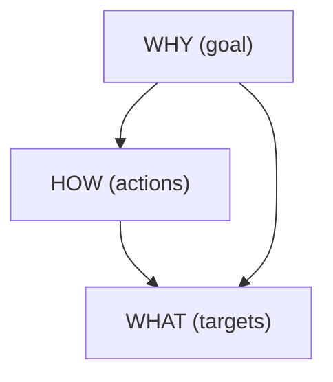

---

## WHY / HOW / WHAT Vocabulary

<div class="grid grid-cols-3 gap-4 mt-6">
  <div class="card">
    <div class="kicker">WHY (goal)</div>
    <div class="text-xl font-700 mt-2">Motivation</div>
    <ul class="mt-3 text-sm leading-6 op85">
      <li><strong>Discover</strong>: find unknown patterns</li>
      <li><strong>Present</strong>: communicate clearly</li>
      <li><strong>Monitor</strong>: track known metrics</li>
      <li><strong>Lookup</strong>: answer a specific question</li>
    </ul>
  </div>

  <div class="card">
    <div class="kicker">HOW (actions)</div>
    <div class="text-xl font-700 mt-2">Verbs</div>
    <ul class="mt-3 text-sm leading-6 op85">
      <li><strong>Search</strong>: lookup · locate · browse · explore</li>
      <li><strong>Query</strong>: filter · sort · group</li>
      <li><strong>Compare</strong>: rank · contrast · benchmark</li>
      <li><strong>Detect</strong>: outliers · change points</li>
    </ul>
  </div>

  <div class="card">
    <div class="kicker">WHAT (targets)</div>
    <div class="text-xl font-700 mt-2">Objects</div>
    <ul class="mt-3 text-sm leading-6 op85">
      <li><strong>Items</strong>: student, section, record</li>
      <li><strong>Groups</strong>: program, cohort</li>
      <li><strong>Attributes</strong>: score, pass_rate, minutes</li>
      <li><strong>Ranges</strong>: week 3–6, pre/post event</li>
      <li><strong>Links</strong>: prereq, collaboration, referral</li>
    </ul>
  </div>
</div>

---

## Decompose the Running Example Into Subtasks

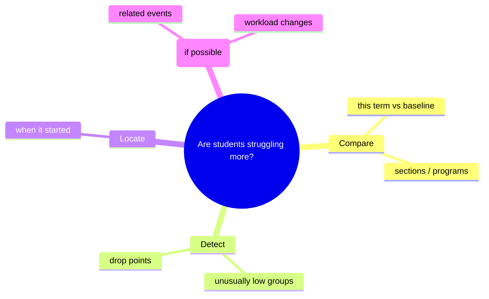

---

## Search Tasks: Lookup → Explore

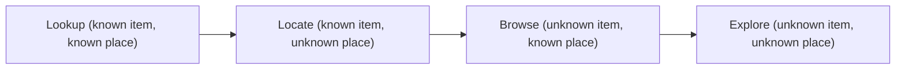

<v-clicks>

- Shneiderman: **overview first → zoom/filter → details on demand**

</v-clicks>

---

## Compare Tasks: Three Common Patterns

<v-clicks>

- **Compare categories:** section A vs B (use aligned scales; sort when needed)
- **Rank:** top/bottom N (make ordering explicit; show ties)
- **Benchmark:** compare to a target (add reference lines/bands)

</v-clicks>

<div class="muted mt-4">
If comparison is the task, design for *alignment* and *readable differences*.
</div>

---

## Distribution Tasks: “What’s Typical?” + “Who Is Different?”

<v-clicks>

- Ask for: center, spread, skew, outliers
- Use: histogram (shape), box plot (summary), violin (density)
- Don’t hide the distribution behind a single average when decisions affect people

</v-clicks>

---

## Relationship Tasks: Correlate, Cluster, or Explain?

<v-clicks>

- **Correlate:** do two measures move together?
- **Cluster:** do groups form naturally (segments)?
- **Explain:** what factors predict an outcome? (needs modeling + careful claims)
- Reminder: correlation ≠ causation; check confounders and sampling bias

</v-clicks>

---

## Tasks ↔ Interactions (Design on Purpose)

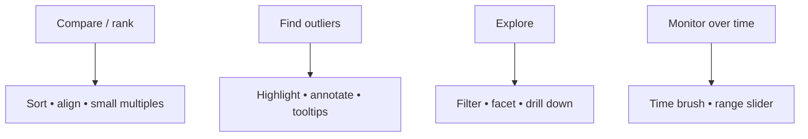

---

## Task Quality Rubric (For Reports and Projects)

<v-clicks>

- Uses a clear **action verb** (compare/rank/detect…)
- Names an explicit **target** (items/groups/attributes/time range)
- States constraints (population/timeframe/baseline)
- Produces an **output** that someone can verify (ranked list, flagged cases, chosen window)

</v-clicks>

---

## Practice 2 (7 minutes): Write Two Task Statements

Pick one dataset from Practice 1 and write:

<v-clicks>

1. One **monitoring** task (ongoing tracking)
2. One **discovery** task (exploration)

</v-clicks>

Use: **Action + Target + Constraints + Output**

---
layout: section
---

<div class="kicker">Part 3 · Design</div>

# <span class="gradient-text">Putting It Together</span>

From abstractions → justified visualization designs

---

## The 4-Step Abstraction Worksheet (Use This Every Time)

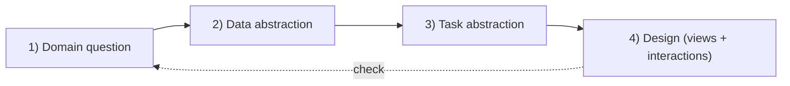

---

## Case Study: Student Performance (A Task-Driven Design)

<v-clicks>

- **Data abstraction:** table of section-week records  
  Variables: section (cat), week (temp), avg_score (quant), pass_rate (quant), n_students (quant)
- **Key tasks:** compare sections, detect drops, locate weeks, drill down to details

</v-clicks>

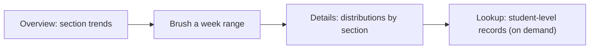

---

## Case Study: Collaboration Network (Different Data, Different Tasks)

<v-clicks>

- **Data abstraction:** network (nodes=orgs, links=collaborations), link weight=quant
- **Tasks:** find hubs, bridge orgs, communities; compare before/after an event
- **Design hint:** combine network view with a sortable table for reliable ranking

</v-clicks>

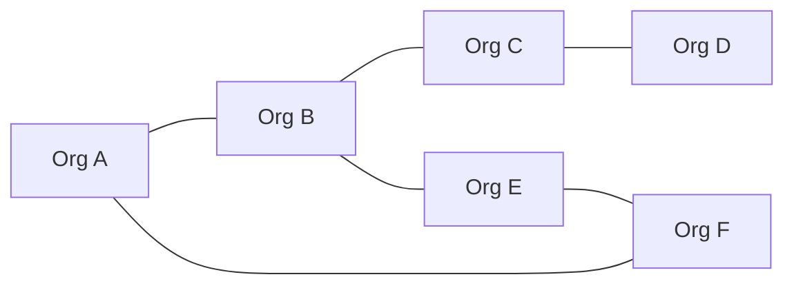

---

## Key Takeaways

<v-clicks>

- Abstraction is the bridge from **domain** to **design**
- Data abstraction: dataset types + attribute types + transformations
- Task abstraction: goals + actions + targets (+ constraints + output)
- Good charts are **defensible** because they directly support tasks
- Avoid common failures: type mixing, raw counts without denominators, over-aggregation, vague tasks

</v-clicks>

---

## Exit Ticket + References

**Exit ticket (answer in 2–3 sentences each)**
1. What is the dataset type and attribute types for your chosen example?
2. Write one task as **Action + Target + Constraints + Output**
3. What interaction would most help that task, and why?

**References**
- Munzner, *Visualization Analysis & Design*
- Brehmer & Munzner (2013), abstract task typology
- Wickham (2014), tidy data

Marc Reyes · `marc.reyes@dlsu.edu.ph`

---

## Python Assignment (Take-Home): Abstraction → Design

<div class="callout mt-6">
  <div class="kicker">Goal</div>
  <div class="text-2xl font-700 mt-2">Turn a domain question into a defendable visualization workflow.</div>
</div>

<div class="grid grid-cols-2 gap-4 mt-6">
  <div class="card">
    <div class="kicker">Write</div>
    <ul class="mt-3 text-sm leading-6 op85">
      <li><strong>1 domain question</strong> (one sentence)</li>
      <li><strong>Data abstraction</strong>: dataset type(s) + variable types</li>
      <li><strong>Task abstraction</strong>: 3 tasks (Action + Target + Constraints + Output)</li>
    </ul>
  </div>
  <div class="card">
    <div class="kicker">Build (Python)</div>
    <ul class="mt-3 text-sm leading-6 op85">
      <li><strong>Transforms</strong>: clean, tidy/reshape, derive measures</li>
      <li><strong>2 charts</strong> that directly support your tasks</li>
      <li><strong>Justification</strong>: 4–6 sentences mapping choices to tasks</li>
    </ul>
  </div>
</div>

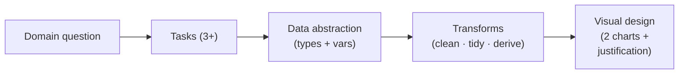

---

## Starter Code + Deliverables

```python
import pandas as pd

df = pd.read_csv("your_data.csv")

# 1) Data abstraction: fix types (example)
# df["date"] = pd.to_datetime(df["date"])

# 2) Transforms: tidy + aggregate for a task
result = (
    df.dropna()
      .groupby(["group", "time"], as_index=False)
      .agg(value=("value", "mean"), n=("value", "size"))
)
```

<div class="grid grid-cols-2 gap-4 mt-6">
  <div class="card">
    <div class="kicker">Submit</div>
    <ul class="mt-3 text-sm leading-6 op85">
      <li><code>abstraction.md</code> (data spec + task statements)</li>
      <li><code>analysis.ipynb</code> (transforms + charts)</li>
      <li>Export charts as <code>.png</code> or <code>.svg</code></li>
    </ul>
  </div>
  <div class="card">
    <div class="kicker">Rubric (simple)</div>
    <ul class="mt-3 text-sm leading-6 op85">
      <li>Correct types + meaningful derived measures</li>
      <li>Tasks are specific and verifiable</li>
      <li>Charts clearly support tasks (not “favorite charts”)</li>
    </ul>
  </div>
</div>
